```{r setup, include=FALSE}
knitr::opts_chunk$set(warning = FALSE, message = FALSE)

library(ggplot2)
library(dplyr)
library(lubridate)
library(readr)
library(tidyverse)


menstru <- read_csv("data/menstru_full.csv")

menstru_24 <- menstru %>% filter(anio == 2024)

menstru_24_toallitas <- menstru_24 %>% filter(categoria == "toallitas")


menstru_anios <- menstru %>% group_by(anio, provincia)%>%
summarise(median_precio = median(precio_unidad))

menstru_top <- menstru_24_toallitas %>% 
group_by(provincia, region)  %>%
summarise(median_precio = median(precio_unidad))%>%
arrange(desc(median_precio))%>%
ungroup()%>%
slice_head(n = 5)

menstru_provs_toallitas <- menstru_24_toallitas %>% group_by(provincia, region)  %>%
summarise(median_precio = median(precio_unidad))

menstru_cat <- menstru_24 %>%
  filter(categoria %in% c("toallitas", "tampones")) %>%
  group_by(categoria) %>%
  summarise(median_precio = median(precio_unidad))
```

# Introducción

En esta clase vamos a profundizar en cómo ggplot2 codifica variables como propiedades visuales mediante la asignación (*mapping* en inglés) de atributos estéticos.

Para que una diferencia entre valores sea perceptible, solemos apoyarnos en posición (ejes x e y), pero también podemos codificar información con color, tamaño, forma o transparencia. Elegir estos canales no es un detalle decorativo: afecta directamente qué tan legible y comparable resulta el gráfico.


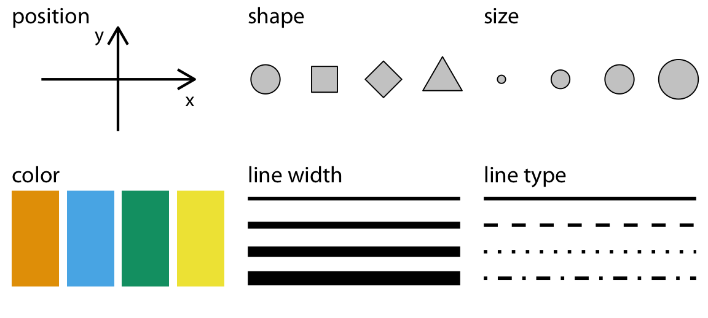{width="68%"}

## Regla mapping vs setting 

Dentro de aes() mapeamos (el atributo cambia según una variable); fuera de aes() fijamos (el atributo es constante para todo el gráfico).

Con ejemplos va a quedar más clara la diferencia.

Para disponer de las funciones de visualización activamos [**ggplot2**](https://ggplot2.tidyverse.org/):

```{r}
library(ggplot2)
```

Volvamos a nuestros datos de #MenstruAcción, que trabajamos en la clase 1. En este caso tenemos el dataframe menstru_top, que tiene los datos de las provincias con la mediana de precios de toallitas más caras:

### Atributos estéticos variables
```{r}
ggplot(menstru_top, aes(x = provincia, y = median_precio, fill = region)) +
  geom_col() +
  labs(title = "Top 5 provincias (2024) - toallitas",
       subtitle = "Fill mapeado: el color depende de la región",
       x = "Provincia", y = "Mediana de precio unitario")
```

### Atributos estéticos fijos

Muchos de los atributos estéticos, como `color`, `fill` y `size` que cambia el tamaño de puntos y grosor de líneas, pueden ser usados como parámetros fijos para una geom. Es decir, que no cambien de acuerdo a los valores de una variable sino que son iguales para todos las figuras graficadas. Esto se logra definiendo un valor específico fuera del llamado a `aes()`. 

Por ejemplo, `fill = "blue"` en lugar de la asignación de una variable, como `aes(fill = región)`. 

```{r}
ggplot(menstru_top, aes(x = provincia, y = median_precio)) +
  geom_col(fill = "blue") +
  labs(title = "Top 5 provincias (2024) - toallitas",
       subtitle = "Fill fijo: todas las barras iguales",
       x = "Provincia", y = "Mediana de precio unitario")
```

Nótese la diferencia: dentro de la función `aes()` no definimos colores específicos, ggplot se encarga de eso. Sólo decimos que los valores encontrados en la columna `city` deben corresponder a diferentes colores. 


## Teoría del color
El color no es meramente un atributo estético: es un canal de codificación poderoso y complejo, porque depende de cómo funciona la visión humana y de cómo el cerebro interpreta contrastes y luminancia.

El color se produce por una mezcla de ondas de luz. Nuestro ojo tiene solo tres receptores distintos, es decir, conos sensibles a longitudes de onda: corta, media, larga. Lo anterior significa que podemos resumir la percepción de cualquier color con solo tres números.

Espacio cromático CIE XYZ (1931)

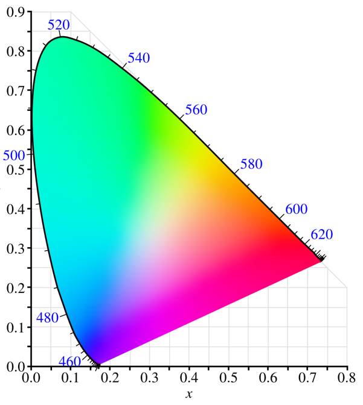{width="40%"}

<br>
Dentro del esquema general de los espacios cromáticos, podemos pensar subespacios. Uno de los más conocidos es RGB: rojo, verde y azul. 
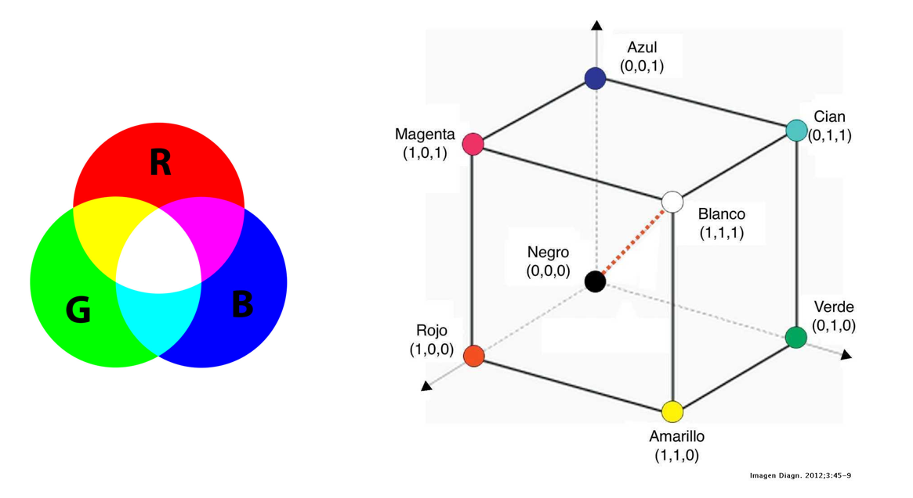{width="50%"}
Sin embargo, este sistema tiene un problema: no es perceptualmente uniforme. Dos colores que estén separados por la misma distancia dentro del cubo no siempre se perciben igual de diferentes por el ojo humano.

Esto explica por qué ciertas paletas engañan: cambian la luminancia de forma irregular.


<br>

El espacio HCL es un intento moderno de representar el color de forma más cercana a cómo realmente lo percibimos.
Se basa en tres componentes:

●	Hue (matiz o tono): varía de 0 a 360 grados, como en un círculo de color, y define si vemos rojo, azul, verde, etc.

●	Chroma (saturación o pureza): mide cuán intenso es el color, desde apagado (cercano al gris) hasta un color muy vivo.

●	Luminancia (brillo): indica cuán claro u oscuro es el color, en una escala que va de 0 (negro) a 1 (blanco).

En la práctica, usar HCL nos ayuda a evitar problemas comunes como paletas demasiado brillantes que distraen o colores que parecen diferentes en pantalla pero en realidad están codificados con la misma intensidad.

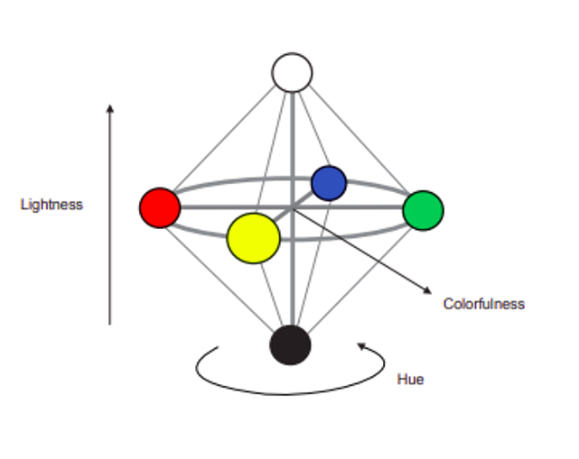{width="50%"}
<br>

El espacio de color CIELAB (1976) que, a diferencia del CIE XYZ (1931), buscó ser perceptualmente uniforme, es decir, que la distancia entre dos colores en este espacio se corresponde, de manera más aproximada, con cómo el ojo humano percibe esa diferencia.


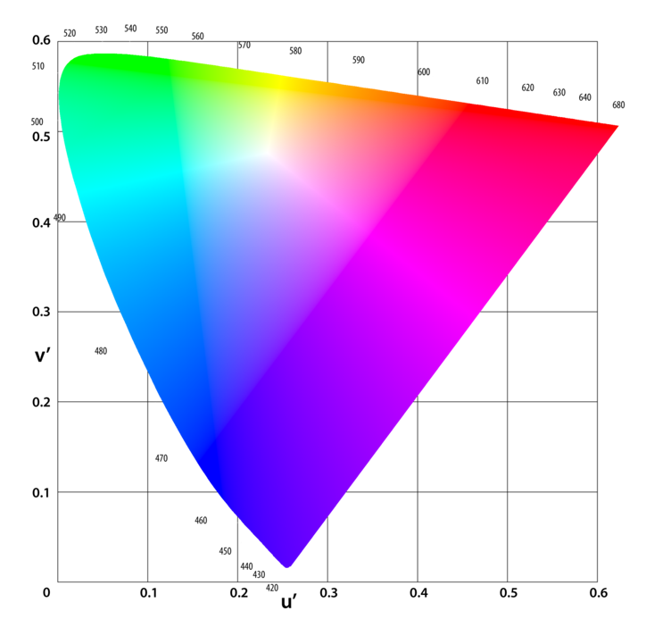{width="40%"}

Una vez que tenemos un espacio cromático perceptualmente uniforme, como CIELAB, podemos movernos dentro de él y crear diferentes paletas de colores.


<br>

###Paletas de colores
Existen tres tipos principales de paletas, cada una con un uso específico:

●	Secuenciales: se usan cuando queremos mostrar progresión o magnitudes que van de bajo a alto (por ejemplo, población, temperatura).

●	Divergentes: sirven cuando queremos resaltar un punto medio y mostrar variaciones hacia dos extremos (por ejemplo, ganancias y pérdidas).

●	Cualitativas: se usan para distinguir categorías sin un orden inherente (por ejemplo, partidos políticos, tipos de frutas).


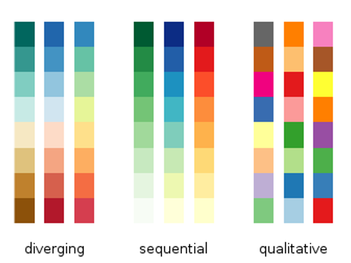{width="68%"}
<br>

Aquí vemos algunos ejemplo de paletas de colores comunes en software estadístico o de visualización (como ser BrBG, Spectral, jet, RdBu, seismic) cuya característica en común es que no son perceptualmente uniforme. En efecto, el ojo humano percibe saltos bruscos entre ciertos colores, aunque en los datos esos saltos no existan. Esto último puede llevar a interpretaciones erróneas, como por ejemplo ver “fronteras” o diferencias más grandes de lo que realmente son.


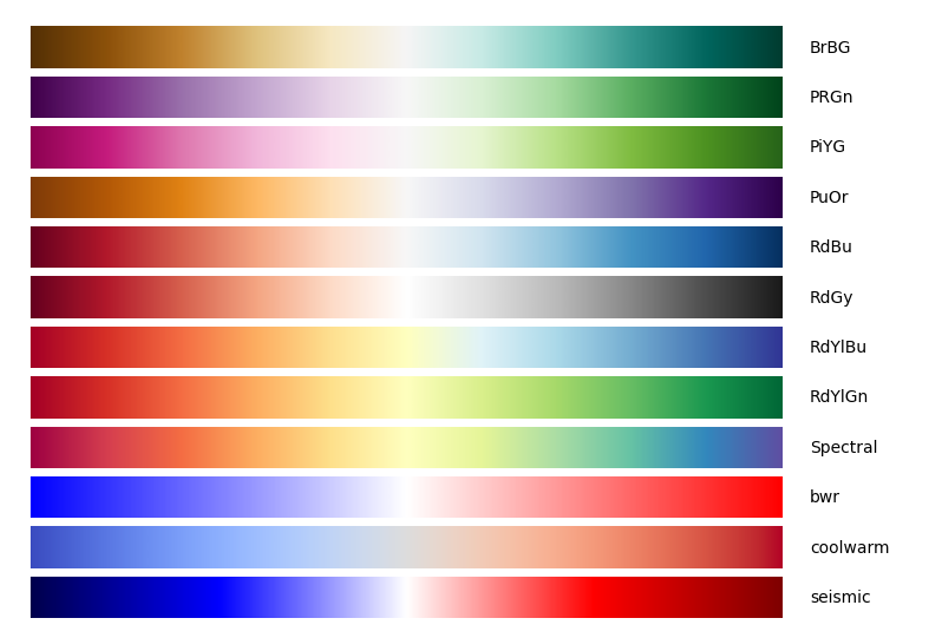{width="68%"}
<br>

La elección de la paleta no es neutral. 
Puede distorsionar la percepción, alterar la narrativa o incluso manipular la interpretación de los datos.

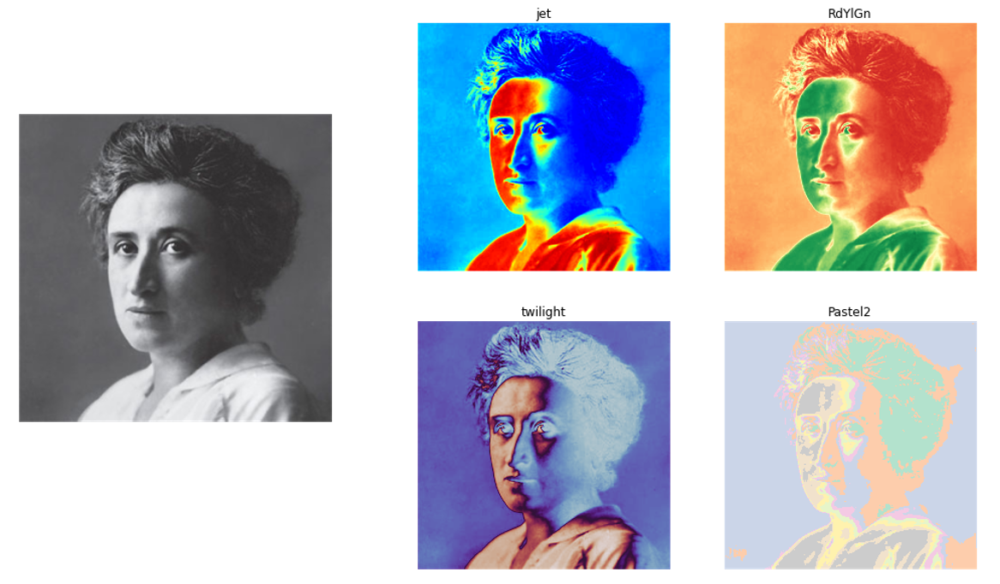{width="50%"}
<br>

### Paletas perceptualmente uniformes

●	Estas son paletas diseñadas específicamente para ser perceptualmente uniformes.

●	Significa que un mismo salto numérico en los datos se percibe con el mismo salto visual en la escala de color.

●	Además, son legibles tanto en pantallas como en impresiones en blanco y negro y algunas son más inclusivas para personas con daltonismo (cividis).

●	Son la opción recomendada en visualización de datos científicos.

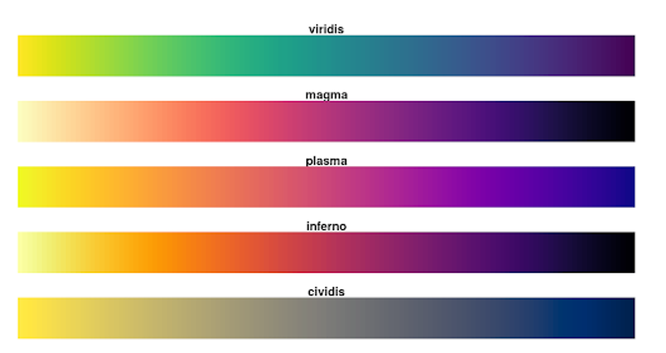{width="50%"}
<br>

Al aplicar estas paletas perceptualmente uniformes, la imagen mantiene sus formas y gradientes sin crear ilusiones de contraste. No hay saltos falsos ni áreas que llamen la atención de manera engañosa.

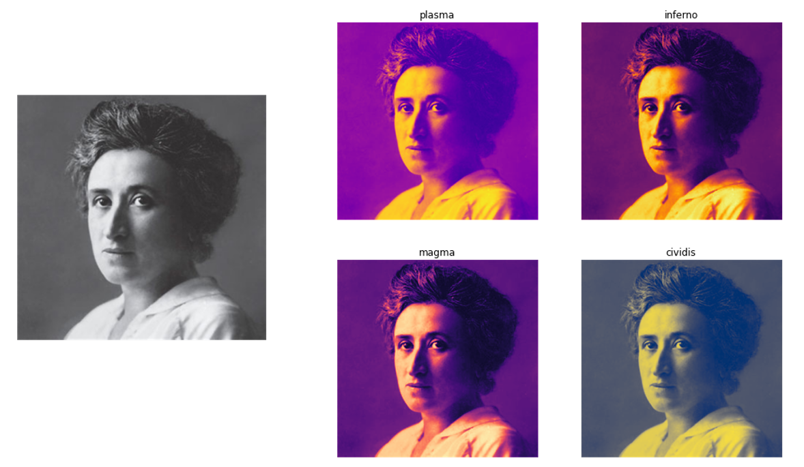{width="50%"}
<br>


En el siguiente panel vemos distintos ejemplos de paletas (perceptualmente uniformes y no uniformes) aplicadas a los mismos datos, que nos permite identificar dos grandes problemas:

1.	distorsión de la percepción del color y la luminancia: el ojo interpreta diferencias más grandes o más pequeñas de lo que realmente son;

2.	discretización implícita de los datos: ciertas paletas, como las que tienen bandas fuertes de color, hacen que datos continuos parezcan “categóricos”, dividiendo en zonas artificiales.


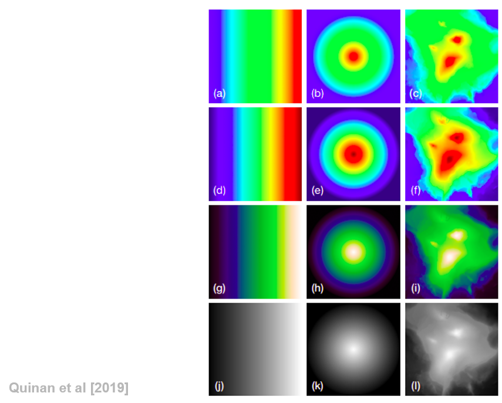{width="50%"}
<br>


Este gráfico usa una escala de color que va de rojo a verde.

¿Qué problema tiene además de que la paleta no es percetualmente uniforme?
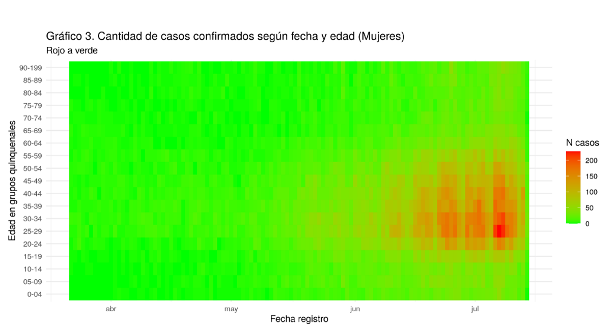{width="50%"}
<br>


Ahora repliquemos el ejemplo, usando la paleta viridis, que fue diseñada para ser perceptualmente uniformes, lo que significa que cada salto en el color corresponde a un cambio perceptible de la misma magnitud.

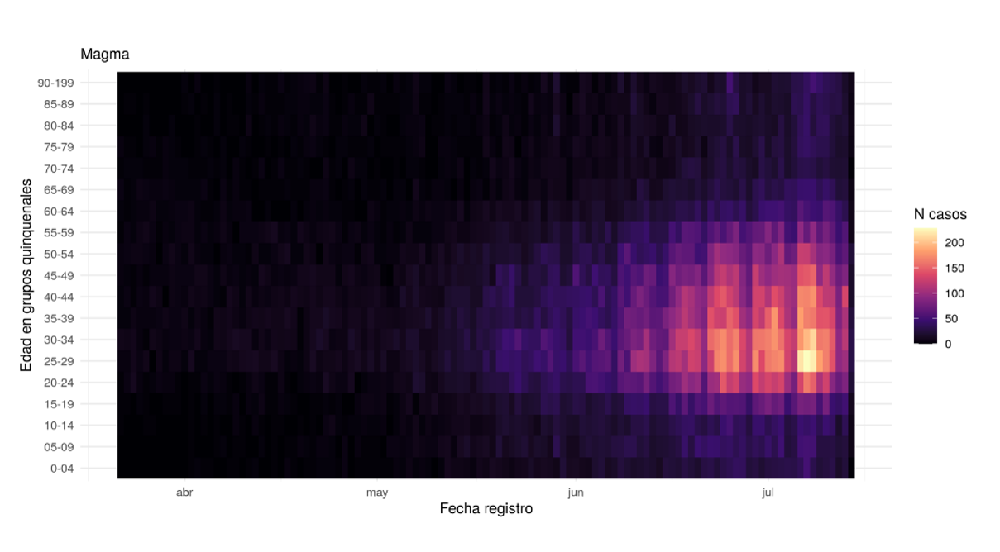{width="50%"}
<br>

Los colores que elijamos en un gráfico van a transmitir un mensaje y tienen poder ser interpretados para el público general. 

Por suerte, R tiene paquetes con paletas de colores que nos permiten resolver algunas de estas cuestiones. Uno de los más popular es `viridis`, cuya paleta de colores están diseñadas para ser:

-   coloridas, brindando una paleta amplia para mostrar diferencias con claridad;
-   perceptualmente uniformes, lo que significa que los valores más cercanos entre ellos tendrán colores más parecidos y los que están más alejados tendrán colores distintos de manera consistente;
-   interpretados fácilmente por personas con daltonísmo; 
-   interpretables si se imprimen en escala de grises.

Usar las paletas viridis es tan simple como añadir una línea de código:

`scale_color_viridis_c()` se usa cuando el color representa una magnitud continua.

`scale_color_viridis_d()` se usa cuando el color sirve para distinguir categorías.


## Atributo estético `fill`

Algunas geoms permiten usar el atributo estético `fill`, que es similar `color` pero se aplica como relleno: pinta” el interior de áreas (barras, polígonos, cajas). En cambio, color suele controlar líneas, bordes y puntos.

Por ejemplo, podemos usar el atributo estético `fill` con `geom_col()` para pintar el interior de cada caja. 

Vamos a probarlo. Generemos un gráfico de `provincia` en las $x$, `median_precio` en las $y$, y coloreemos el interior de columna caja según su región.

```{r message=FALSE, warning=FALSE}
library(viridis)

ggplot(menstru_cat,
       aes(x = categoria,
           y = median_precio,
           fill = categoria)) +
  geom_col() +
  scale_fill_viridis_d() +
  labs(
    title = "Precio mediano por tipo de producto (2024)",
    x = "Categoría",
    y = "Precio unitario mediano"
  )
```


En esta clase priorizamos viridis por razones perceptuales y de accesibilidad, pero existen muchas alternativas. [`wesanderson`](https://github.com/karthik/wesanderson), con colores de películas de Wes Anderson, o [`SailorMoonR`](https://github.com/morgansleeper/SailorMoonR) con colores de Sailor Moon.


## Cantidades, proporciones y distribuciones

Un objetivo típico al visualizar datos es mostrar magnitudes, composiciones y variabilidad. 

Cuando representamos números absolutos visualizamos cantidades; por ejemplo, la cantidad de medallas olímpicas que han ganado distintos países.
Cuando los expresamos como parte de un total visualizamos proporciones; por ejemplo, a variación anual en venta de pasajes de distintas aerolíneas.
Cuando buscamos entender cómo se reparten los valores de una variable, visualizamos una distribución; por ejemplo, o los votos recibidos por cada partido político que se presentó a elecciones.

Por lo simple y efectiva, la herramienta inescapable para visualizar cantidades, proporciones y distribuciones es el gŕafico de barras. 

A los seres humanos nos resulta más fácil comparar "a ojo" diferencias de largo, como la altura a la que llegan las barras, que diferencias de ángulo y área como las que requieren los gráficos de torta. Abajo se ilustra este punto: el gŕafico de torta *a)* muestra los mismos valores que el gráfico de barras *b)*, pero en el primero es muy difícil discernir diferencias, mientras que con el segundo se puede lograr de inmediato.

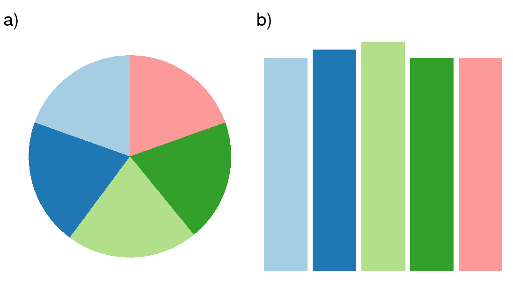{width="60%"}


### Mostrando cantidades con gráficos de barras. 
`ggplot2` nos ofrece dos funciones para generarlos: `geom_col()` y `geom_bar()`. 

`geom_col()` se usa cuando queremos mostrar una variable numérica
`geom_bar()` se emplea cuando queremos mostrar la frecuencia con la que aparecen las clases de una variable categórica. 

Con ejemplos va a quedar más clara la diferencia, continuamos con nuestros datos de #MenstruAcción con el dataframe menstru_top que contiene las provincias con la mediana de precios de toallitas más caras.
```{r }
menstru_top
```

Tenemos una cantidad a representar con barras, así que usamos `geom_col()`. Hagamos un gráfico de barras de `median_precio` versus `Provincia`. O sea, que `median_precio` va en el eje de las $y$ y `Provincia` en el de las $x$:

```{r}
ggplot(menstru_top, aes(x = provincia, y = median_precio)) +
  geom_col()
```

Los resultados son bastante parejos. Si quisiéramos mostrar a que región pertenece cada provincia (cada barra) con un color distinto, intuitivamente pensamos en asignar el atributo estético de "color" a la región. Probemos:

```{r}
ggplot(menstru_top, aes(x = provincia, y = median_precio, color = region)) +
  geom_col()
```

¡Ups! Cuando usamos el atributo "color" con geometrías de área (como las barras), lo que controlamos es el color de su línea externa. Si bien el recurso funciona para diferenciar categorías, es poco legible. El atributo que necesitamos aquí es "fill", el color de relleno para nuestras barras. Vamos:

```{r}
ggplot(menstru_top, aes(x = provincia, y = median_precio, fill = region)) +
  geom_col()

```

Así está mejor.

Veamos que pasa cuando tenemos una cantidad bastante mayor de barras. Por ejemplo, para comparar la mediana de precios de toallitas para todas las provincias. En este caso, mostramos las barras en forma horizontal poniendo la variable categórica en las $y$ y la numérica en las $x$:

```{r}
ggplot(menstru_provs_toallitas, aes(x = median_precio, y = provincia)) +
  geom_col()
```

Aquí los valores desordenados (o en todo caso, ordenados por la provincia a la que corresponden y no por magnitud) hacen difícil leer el gráfico.

Por suerte este tipo de problema tiene arreglo inmediato: hay que ordenar las barras por tamaño. 

Una forma de hacerlo es con la función `fct_reorder()`, incluida en el paquete [forcats](https://forcats.tidyverse.org/) que trae toda clase de herramientas para trabajar con data categórica. Usando la función con ggplot empleamos dos parámetros: una variable a mostrar y otra variable por la cual reordenar la variable a mostrar. 

Para que las provincias se grafiquen en el orden de la mediana de precios, sería:

```{r echo=TRUE}
# Activamos el paquete que incluye la función fct_reorder()
library(forcats)

ggplot(menstru_provs_toallitas, 
       aes(x = median_precio, 
            y = fct_relevel(fct_reorder(provincia, median_precio), "Buenos Aires", after = 24))) +
  geom_col()  +
  labs(y = "Provincia",
       x = "Mediana de precio")
```

Ahora, vamos a un caso en el cual no queremos mostrar una medida resumen, sino conteos: cuantas veces aparece cada valor en una variable categórica. Este es el dominio de `geom_bar()`.

Para practicar, aquí tenemos los datos de precios de productos menstruales en marzo de 2021 completos.

```{r}
menstru_24 %>%
  slice(1:5)
```

Visualicemos la cantidad de observaciones que tiene cada región. Para usar `geom_bar()` asignamos a las $x$ la variable a contar. No hace falta asignar una variable a las $y$, porque la altura de cada barra no depende de los valores de alguna otra columna, sino del conteo de subcategorías en la variable de las $x$.

```{r}
ggplot(menstru_24, aes(x = region)) +
  geom_bar()
```

Vemos dos cosas. A nivel analítico, el AMBA está sobrerrepresentado en la muestra. Por otro lado, podemos observar que `geom_bar()` se encarga de contar cuantas veces aparece cada categoría de la variable de interés. Pero eso no es todo: también podemos mostrar la distribución de sub-categorías. Para hacerlo más claro con un ejemplo: mostrar cuántos registros de toallitas y tampones hay por región.

Para mostrar la composición de grupos y subgrupos, usamos de nuevo `geom_bar()` y asignamos el grupo adicional al atributo estético fill. Para nuestro ejemplo, volvemos a usar "Region" para las $x$, y asignamos "Categoría" a "fill".

```{r}
ggplot(menstru_24, aes(x = region, fill = categoria)) +
  geom_bar()
```

Si no aclaramos nada, geom_bar() apila las cantidades de cada subgrupo en la categoría que les corresponda. Para mostrar las subcategorías en barras separadas, usamos la opción `position = "dodge"`

```{r}
ggplot(menstru_24, aes(x = region, fill = categoria)) +
  geom_bar(position = "dodge")
```

### Mostrando proporciones

Podemos usar `geom_col` y `geom_bar()` para que muestren partes de un todo en lugar de cantidades o conteos de frecuencia.

Por ejemplo, para ver la cantidad de casos de cada categoría deberíamos hacer algo así:

```{r }
ggplot(menstru_24, aes(x = categoria)) +
  geom_bar()
```

Para convertirlo en uno que muestre la proporción de categorías en el total, hacemos dos ajustes:

-   A `x` ya no le asignamos una variable, sino un nombre arbitrario (en texto). El texto es libre y va entre comillas, por ejemplo "proporción" o un texto vacío como "".
-   La variable de interés (en este caso, "Categoría") se asigna al atributo estético "fill"

```{r}
ggplot(menstru_24, aes(x = "el todo", fill = categoria)) +
  geom_bar(position = "fill")
```

Aquí podemos aprovechar para mostrar como controlar la orientación de las barras (horizontales vs. verticales) y su ancho. Para que las barras se dibujen en forma horizontal usamos "y" en lugar de "x". Para controlar su tamaño, usamos el parámetro `width`. Con valores de `width` menores a 1 se dibujan barras más delgadas, y con mayores a 1 se generan barras más gruesas. Por ejemplo, hagamos que width adopte el valor 0.5:

```{r}
ggplot(menstru_24, aes(y = "", fill = categoria)) +
  geom_bar(position = "fill", width = 0.5)

```

Convertir nuestro gráfico con subgrupos para que pase de mostrar cantidades a proporciones es aún más directo: basta con usar el parámetro `position = "fill"`. Intentémoslo:

```{r}
ggplot(menstru_24, aes(x = region, fill = categoria)) +
  geom_bar(position = "fill")
```


## Gráfico de tortas

Si hacer una barra que muestre la proporción de valores por categoría es cuestión de:

```{r}
ggplot(menstru_24, aes(y = "", fill = categoria)) +
  geom_bar(position = "fill")
```

Un gráfico de torta no es otra cosa que un gráfico de barras que usa un sistema de [coordenadas polares](https://es.wikipedia.org/wiki/Coordenadas_polares) en lugar de unas cartesianas. Por defecto, ggplot representa los datos usando coordenadas cartesianas, pero permite pasar a polares usando `coord_polar()` (y el tema "void" se usa sólo para limpiar todo elemento del plot que no sea deliciosa torta):

```{r}
ggplot(menstru_24, aes(y = "", fill = categoria)) +
  geom_bar(position = "fill") +
  coord_polar() +
  theme_void()
```

Ahora bien, ¿por qué preferimos alejarnos de este tipo de gráficos? Wilke nos lo explica brevemente en una bella tablita:

|                                                                                                              | Gráfico de torta | Barras apiladas | Barras al lado de la otra |
|--------------------------------------|------------|------------|------------|
| Me muestra los datos como proporciones de un todo                                                            | ✔                | ✔               | ✖                         |
| Me permite una comparación visual fácil de las proporciones relativas                                        | ✖                | ✖               | ✔                         |
| Se ve bien incluso para datasets muy pequeños                                                                | ✔                | ✔               | ✔                         |
| Funciona bien cuando el *todo* tiene muchos subgrupos                                                        | ✖                | ✖               | ✔                         |
| Funciona bien para visualizar varios grupos de proporciones o proporciones a lo largo de una serie de tiempo | ✖                | ✔               | ✖                         |

: Claus O. Wilke, Fundamentals of Data Visualization

Cuando trabajamos con dos categorías no es tan problemático, pero veamos las diferencias entre mostrar las proporciones de regiones de las tres maneras.

```{r message=FALSE, warning=FALSE}
library(grid)
library(gridExtra)

g1 <- ggplot(menstru_24, aes(y = "", fill = region)) +
  geom_bar(position = "fill") +
  coord_polar() +
  scale_fill_viridis_d()+
  theme_void()

 g2 <- ggplot(menstru_24, aes(x = "", fill = region)) +
  geom_bar(position = "fill", width = 0.5) +
   scale_fill_viridis_d()+
   theme_minimal()
 
 g3 <- ggplot(menstru_24, aes(x = region)) +
  geom_bar()  +
  theme_minimal()
 
 
grid.arrange(g1, g2, g3, ncol=2)

```


## Distribuciones

### Un clásico: el histograma

La visualización por excelencia para mostrar distribuciones es el histograma, que en la práctica es una variante de... ¡gráfico de barras!.

Hacer un histograma es simple. Por ejemplo, para mostrar cómo se distribuye la variable "precio_unidad" la asignamos a las `x` y usamos `geom_histogram()`:

```{r}
ggplot(menstru_24_toallitas, aes(x = precio_unidad)) +
  geom_histogram()
```

El histograma muestra 1) el rango que toman los valores (del mínimo al máximo que alcanzan) y 2) la frecuencia se los observa en cada rango. Por ejemplo, el precio por unidad en 2021 puede llegar hasta casi los 60 pesos en algún caso, pero los casos por encima de 20 pesos son infrecuentes. Y de hecho, los valores más comunes rondan los 15\$ por unidad.

Algo para advertir sobre los histogramas es que su aspecto (y con ello, el mensaje que dan) puede cambiar de acuerdo a la cantidad de intervalos que se usen. 
Por defecto `geom_histogram()` divide al rango de valores en 30 "bins" o intervalos iguales (por ejemplo "de 0 a 10", "de 10 a 20", etc) y cuenta cuántas observaciones caen en cada uno. Podemos controlar la cantidad de intervalos con el parámetro `bins`. También, podemos aumentar el nivel de detalle del histograma incrementando la cantidad de intervalos, a costa de perder generalización. Y a la inversa: si reducimos el nivel de intervalos, mostramos una distribución más resumida de la data, a costa de perder detalle.

Juguemos con los valores de `bins` para ver como cambia el resultado. ¿Y cuál es el número ideal de intervalos? Depende de las características de cada dataset y de lo que queremos mostrar... ¡no hay una sola respuesta correcta! Para este caso, probemos 50 bins:

```{r}
ggplot(menstru_24_toallitas, aes(x = precio_unidad)) +
  geom_histogram(bins = 50)
```

### El gráfico de densidad

Los gráficos de densidad son descendientes directos de los histogramas. Pero en lugar de conteos de observaciones por rango de valores, lo que muestran es la distribución de *probabilidad* de la variable. Es decir, qué tan probable es encontrar un valor determinado si tomáramos al azar una de las observaciones. A diferencia de los histogramas, que llevan un par de siglos en uso porque porque son relativamente fáciles de hacer a mano, los (antes) trabajosos gráficos de densidad se han popularizado con la llegada de software y computadoras capaces de realizarlos en un instante.

Los gráficos de densidad se hacen de forma análoga a los histogramas, reemplazando `geom_histogram()` `geom_density()`. Probemos con los valores de "precio_unidad" en la región Patagónica.

```{r}
ggplot(menstru_24 %>% filter(region == "PAT"), aes(x = precio_unidad)) +
  geom_density()
```

Los resultados de `geom_density()` se interpretan de forma similar a los de `geom_histogram()`: Notamos el rango que toman los datos, y que tan comunes son en un rango en comparación con otro. Una ventaja de usar densidad en lugar de histograma se pone de relieve al comparar resultados según categorías internas de la data. Por ejemplo, si queremos mostrar las distintas distribuciones de precio según región, usamos el atributo estético "fill" igual que con los gráficos de barras. Con histogramas, sería así.

```{r}
ggplot(menstru_24 %>% filter(region == "PAT"), aes(x = precio_unidad, fill = categoria)) +
  geom_histogram()
```

¡El resultado es un lío! Las barras apiladas no son ideales para interpretar distribuciones. Las cosas mejoran un poco si usamos `position = "dodge"`, pero no mucho:

```{r, echo=TRUE}
ggplot(menstru_24 %>% filter(region == "PAT"), aes(x = precio_unidad, fill = categoria)) +
  geom_histogram(position = "dodge")
```

Probemos ahora usando `geom_density()`:

```{r}
ggplot(menstru_24 %>% filter(region == "PAT"), aes(x = precio_unidad, fill = categoria)) +
  geom_density()
```

El resultado es mucho más interpretable. Por ejemplo, salta a la vista que los tampones son considerablemente más caros que las toallitas. Para revelar cualquier "sorpresa" que pudiera haber quedado oculta en las distribuciones tapadas por otras, ajustamos el atributo de `alpha`, que por cierto puede usarse con cualquier geometría de ggplot para controlar su grado de transparencia. Intentemos asignando una transparencia del 50% con `alpha = 0.5`,:

```{r}
ggplot(menstru_24 %>% filter(region == "PAT"), aes(x = precio_unidad, fill = categoria)) +
  geom_density(alpha = 0.5)
```


### Boxplots

Volvamos a nuestras visualizaciones de distribución. Ya hicimos histogramas (con `geom_histogram()`) y gráficos de densidad (con `geom_density()`), pero ahora vamos a usar un "boxplot".

`geom_boxplot()` crea *boxplots* (o ["diagramas de caja"](https://economipedia.com/definiciones/diagrama-de-caja.html)). 

Los boxplots pueden interpretarse como un histograma al que se lo ha colgado "de cabeza", y luego resumido mostrando su hitos:

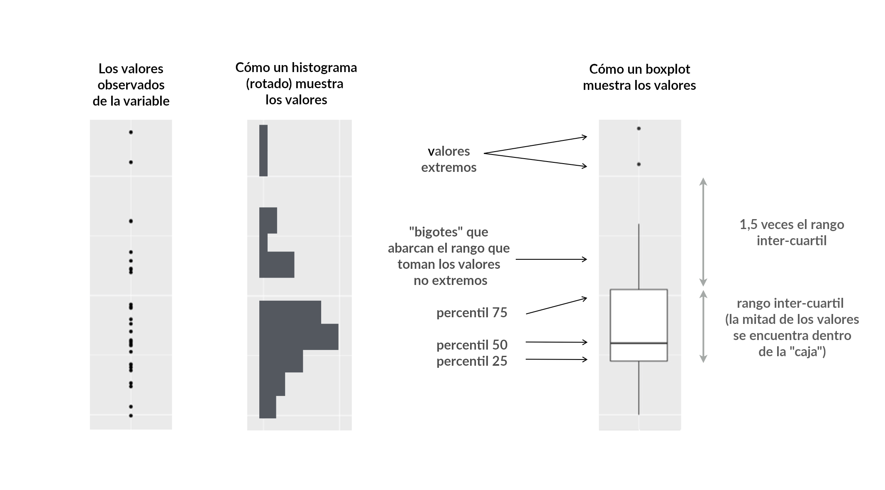{width="100%"} 
Es útil cuando queremos comparar distribuciones entre grupos (por ejemplo, categorías de producto o provincias). En general, ubicamos la variable categórica en el eje $x$ y la variable numérica en el eje $y$.

¡Hagamos eso mismo! Pongamos `categoria` en el eje $x$ (como variable categórica), `precio_unidad` en el eje de las $y$, y a dibujar cajas con `geom_boxplot()`.

```{r}
ggplot(menstru_24 %>% filter(categoria %in% c("toallitas", "tampones")),
       aes(x = categoria, y = precio_unidad)) +
  geom_boxplot()
```

¿Qué pasa si lo damos vuelta?

```{r}
ggplot(menstru_24 %>% filter(categoria %in% c("toallitas", "tampones")),
       aes(x = precio_unidad, y = categoria)) +
  geom_boxplot()

```
¿Cómo nos quedaría con la paleta viridis?

```{r}
ggplot(menstru_24 %>% filter(categoria %in% c("toallitas", "tampones")),
       aes(y = precio_unidad, x = categoria, fill =categoria)) +
  geom_boxplot() +
  scale_fill_viridis_d()
```


Ahora asignemos el color como atributo dependiente de la categoria, pero dejemos el color de las líneas fijo en color azul marino (`"navy blue"`) de acuerdo a los [nombres de colores que R sabe interpretar](http://www.stat.columbia.edu/~tzheng/files/Rcolor.pdf)

```{r}
ggplot(
  menstru_24 %>% filter(categoria %in% c("toallitas", "tampones")),
  aes(x = categoria, y = precio_unidad, fill = categoria)
) +
  geom_boxplot(color = "navyblue") +
  scale_fill_viridis_d()
```

Ahora al revés, asignemos la variable `categoria` al color de las líneas, pero dejemos el relleno de las cajas fijo en color `"navyblue"`.

```{r}
ggplot(menstru_24 %>% filter(categoria %in% c("toallitas", "tampones")),
       aes(x = categoria, y = precio_unidad, color = categoria)) +
  geom_boxplot(fill = "navyblue") +
  scale_color_viridis_d()

```

El gráfico que obtuvimos funciona como recordatorio de que en muchas ocasiones la cantidad de recursos visuales volcados resulta inversamente proporcional a su legibilidad. 

Si bien, en general simple es bueno, también conviene saber que podemos combinar varias estéticas dentro de `aes()` cuando resulte necesario.


### Facetados

Otra manera de mostrar comparaciones entre categorías es a través de los facetados, con las variantes de la función `facet_wrap()`. La función original, provista por ggplot, nos permite seleccionar una variable para desagruparla y graficarla en varios paneles. Pero a partir de esta función original se crearon otras variantes que nos permiten, por ejemplo, hacer zoom en un área determinada del gráfico. 

Hagamos un gráfico de densidad de los precios de toallitas en las regiones Pampeana y Patagónica:

```{r}
ggplot(menstru_24_toallitas %>% filter(region == "PAT" | region == "PAM"), aes(x = precio_unidad, fill = region)) +
  geom_density(alpha = 0.5)
```

Es difícil ver las diferencias entre los precios con mayor probabilidad ya que algunos outliers achican el gráfico. Para hacer un zoom entre los precios más comunes, puedo usar la función `facet_zoom()` del paquete `ggforce`. Sólo tengo que pasarle al parámetro `xlim` los valores donde quiero que haga ese zoom.

```{r}
library(ggforce)

ggplot(menstru_24_toallitas %>% filter(region == "PAT" | region == "PAM"), aes(x = precio_unidad, fill = region)) +
  geom_density(alpha = 0.5)+
  facet_zoom(xlim = c(5000, 11000))
```

Ahora bien, supongamos que quisiera ver la distribución de probabilidad para toallitas y tampones, para ver si ambas tienen una dispersión similar. Puedo usar la función `facet_wrap()`, a la cual le tengo que pasar con la función `vars()` el nombre de la variable por la cual se va a ordenar el facetado. En este caso, "Categoría".

```{r}
ggplot(menstru_24 %>% filter(region == "PAT" | region == "PAM"), aes(x = precio_unidad, fill = region)) +
  geom_density(alpha = 0.8)+
  facet_wrap(vars(categoria))
```

A este gráfico se le pueden hacer varias mejoras.

-   En primer lugar, podemos controlar la cantidad de filas y columnas que tiene el facetado con el parámetro `nrow` o `ncol`. Como aquí nos interesa más que se vea de forma clara el "largo" de la distribución de precios, vamos a decirle a ggplot que queremos que nuestro gráfico tenga dos filas con `nrow = 2`.
-   Por default, el facetado me pone la misma escala para los ejes x e y. Es decir que para ambos paneles tendré en el eje x el valor máximo entre las dos categorías, es decir, los 60 \$ de las toallitas. Como no queremos que esto suceda, vamos a poner el parámetro `scales = "free"`.
-   Y vamos a pasarle `theme_minimal()` para limpiar la apariencia del gráfico y `scale_fill_viridis_d()` para tener una paleta de colores más clara.

```{r}
library(viridis)

ggplot(menstru_24 %>% filter(region == "PAT" | region == "PAM"), aes(x = precio_unidad, fill = region)) +
  geom_density(alpha = 0.8)+
  facet_wrap(vars(categoria),
             nrow=2,
             scales = 'free')+
  theme_minimal()+
  scale_fill_viridis_d()
```

### ¡Y mas!

Existen muchas, muchas otras formas de comparar cantidades, distribuciones y proporciones. Por ejemplo, tenemos ["ridgeline plots"](https://r-charts.com/es/distribucion/ggridges/) que son otra buena alternativa para mostrar gráficos de densidad de forma ordenada:

```{r}
library(ggridges)
library(ggplot2)

ggplot(menstru_24_toallitas , aes(x = precio_unidad, y = region, fill = region)) +
  geom_density_ridges() +
  theme_minimal() + 
  theme(legend.position = "none")
```

Finalmente, lo podemos terminar de tunear con el paquete `ggtext`. Vamos a hacer las siguientes funciones:

-   Creamos la columna `color` que adopta valores de colores según la región, y la columna `name` que pega con formato **Markdown** el valor de texto con un estilo de color (es decir, que "PAT" se imprima en deepskyblue, "GBA" en slategrey... y así).

-   En ggplot agregamos `scale_fill_identity()`, que hace que ggplot entienda que los valores que mapeamos de la columna `color` son exactamente los colores que queremos utilizar para las distintas regiones.

-   Por último, en el theme ponemos que los elementos del eje y (`axis.text.y` y `axis.title.y`) sean un elemento de markdown, así los genera con colores.

```{r}
library(ggtext)
library(glue)

menstru_24_toallitas %>% 
  mutate(color = case_when(
    region == "PAT" ~ "deepskyblue4",
    region == "AMBA" ~ "slategrey",
    region == "NOA" ~ "orange",
    region == "NEA" ~ "orange4",
    region == "PAM" ~ "sienna1",
    region == "CUY" ~ "darkolivegreen4"
  ),
  name = glue("<b style='color:{color}'>{region}")) %>%
  ggplot(aes(x = precio_unidad, y = name, fill = color)) +
  geom_density_ridges() +
  scale_fill_identity()+
  labs(title = "Precios de toallitas",
       subtitle = "en Argentina, 2021",
       x = "Precio unitario",
       caption = "**Fuente:** EcoFemiData")+
  theme_minimal() + 
  theme(legend.position = "none",
        plot.caption = element_markdown(lineheight = 1.2),
        axis.text.y = element_markdown(),
        axis.title.y = element_blank())

```


Para seguir leyendo sobre la visualización de cantidades, proporciones y distribuciones tienen nada menos que los capítulos [7](https://clauswilke.com/dataviz/histograms-density-plots.html), [8](https://clauswilke.com/dataviz/ecdf-qq.html) y [11](https://clauswilke.com/dataviz/nested-proportions.html) de *Fundamentals of Data Visualization* por Claus Wilke.


