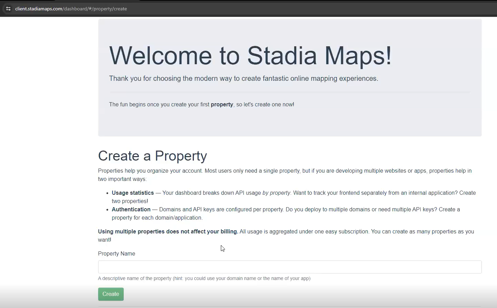
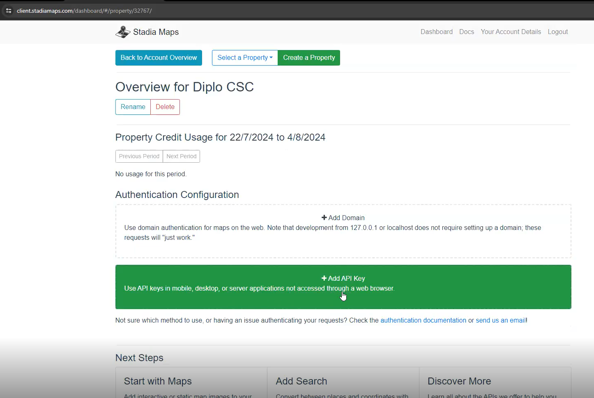
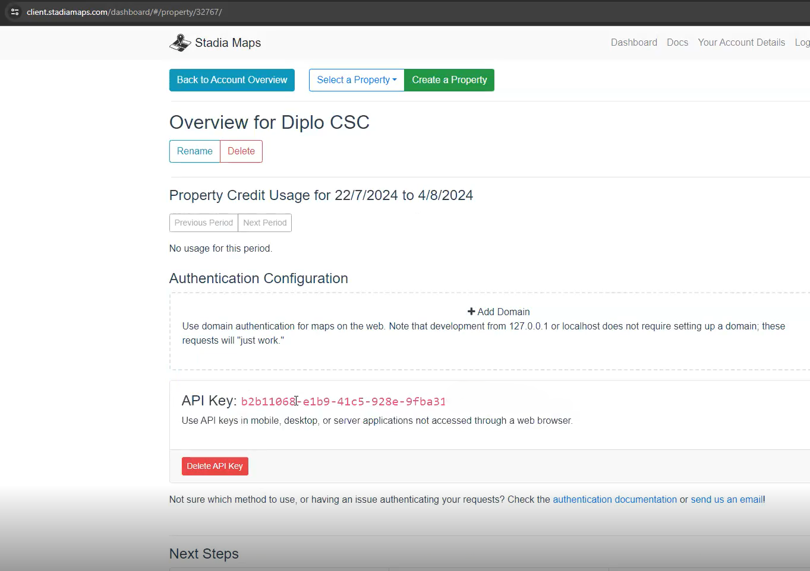

## Obteniendo cartografía de internet - StadiaMaps

Para utilizar StadiaMaps, necesitamos crear una api key (una llave que funciona como código identificador personal).

### Paso 1:
Ingresar en el site [Stadia Maps](https://client.stadiamaps.com/accounts/login/?next=/dashboard/)
, crear usuario (en caso de no tenerlo previamente) e iniciar sesión

### Paso 2:
Crear una property indicando el nombre en el recuadro _Property Name_ + _Create_  


### Paso 3:
Añadir API Key mediante el botón _Add API Key_


### Paso 4:
Copiar API Key generada


### Paso 5:
Incorporar API Key en el código (entre " ")
```{r eval = FALSE}
register_stadiamaps(key = "b2b11068-e1b9-41c5-928e-9fba31")
```

¡Recuerden que cada API Key es de uso personal y cada usuario tiene una cantidad limitada de usos!

