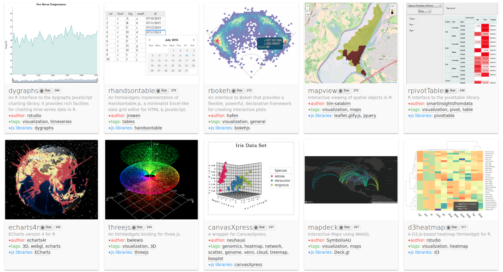

```{r setup, include=FALSE}
knitr::opts_chunk$set(warning = FALSE, message = FALSE)

req <- c("eph", "dplyr", "ggplot2", "forcats", "tidyr", "plotly")
for (pkg in req) {
  if (!requireNamespace(pkg, quietly = TRUE)) install.packages(pkg)
  suppressPackageStartupMessages(library(pkg, character.only = TRUE))
}

df_raw <- eph::get_microdata(year = 2025, trimester = 2, type = "individual")

regiones_labels <- data.frame(
  REGION = c(1, 40, 41, 42, 43, 44, 45),
  nombre_region = c(
    "Gran Buenos Aires",
    "Pampeana",
    "Noroeste (NOA)",
    "Noreste (NEA)",
    "Cuyo",
    "Patagonia",
    "Resto urbano"
  )
)

eph_rank_region <- df_raw %>%
  filter(!is.na(IPCF), IPCF > 0) %>%
  group_by(REGION) %>%
  summarise(
    mediana_ingreso = median(IPCF),
    n = dplyr::n(),
    .groups = "drop"
  ) %>%
  left_join(regiones_labels, by = "REGION")


eph_rank_region2 <- eph_rank_region %>%
  mutate(
    mediana_nacional = median(mediana_ingreso),
    nivel = ifelse(mediana_ingreso >= mediana_nacional, "Arriba de la mediana", "Abajo de la mediana")
  )

eph_ocup_sector <- df_raw %>%
  filter(ESTADO == 1, !is.na(SECTOR), !is.na(PONDERA)) %>%
  group_by(SECTOR) %>%
  summarise(
    n_pond = sum(PONDERA),
    .groups = "drop"
  ) %>%
  mutate(p = n_pond / sum(n_pond),
         SECTOR = fct_reorder(factor(SECTOR), n_pond))


sectores_labels <- tibble(
  SECTOR = c(1, 2, 3, 4),
  nombre_sector = c(
    "Sector público estatal",
    "Sector privado formal",
    "Sector privado informal",
    "Trabajo independiente / mixto"
  )
)

ramas_labels <- tibble(
  CAT_INAC = c(1,2,3,4,5),
  nombre_inac = c(
    "Estudiante",
    "Jubilado/a o pensionado/a",
    "Tareas de cuidado del hogar",
    "Persona con discapacidad",
    "Rentista / otros"
  )
)

eph_ocup_sector <- df_raw %>%
  filter(ESTADO == 1, IPCF > 0) %>%
  mutate(CAT_INAC = as.integer(CAT_INAC)) %>%
  left_join(sectores_labels, by = "SECTOR")

eph_treemap <- df_raw %>%
filter(ESTADO == 1, !is.na(SECTOR), IPCF > 0) %>%
group_by(SECTOR) %>%
summarise(n_pond = sum(PONDERA), .groups = "drop") %>%
left_join(sectores_labels, by = "SECTOR") %>%
mutate(p = n_pond / sum(n_pond))


eph_sector <- df_raw %>% 
  filter(CH06 >= 18, ESTADO == 1) %>% 
  mutate(
    Sector = dplyr::case_when(
      PP04A == 1 ~ "Público",
      PP04A == 2 ~ "Privado",
      TRUE ~ NA_character_)) %>%
  filter(!is.na(Sector)) %>%
  count(Sector, name = "n") %>%
  mutate(porc = round(100 * n / sum(n))) %>%
  tidyr::uncount(porc) %>%
  mutate(id = row_number() - 1,
         fila = id %/% 10,
         col = id %% 10)


eph_heat <- df_raw %>% 
  left_join(regiones_labels, by = "REGION") %>%  
  filter(!is.na(IPCF), IPCF > 0, CH06 >= 18, !is.na(REGION), !is.na(CH04)) %>%
  mutate(
    edad_grupo = cut(CH06,
                     breaks = c(18, 25, 35, 45, 55, 65, Inf),
                     right = FALSE,
                     labels = c("18-24","25-34","35-44","45-54","55-64","65+")),
    genero = case_when(
      CH04 == 1 ~ "Varón",
      CH04 == 2 ~ "Mujer",
      TRUE ~ "Otro/NA"
    )
  ) %>%
  group_by(nombre_region, edad_grupo, genero) %>%
  summarise(ingreso_promedio = mean(IPCF, na.rm = TRUE), .groups = "drop") %>%
  group_by(nombre_region) %>%
  mutate(ord = median(ingreso_promedio, na.rm = TRUE)) %>%
  ungroup() %>%
  mutate(nombre_region = forcats::fct_reorder(nombre_region, ord))

eph_dist <- df_raw %>%
  left_join(regiones_labels, by = "REGION") %>%
  filter(!is.na(IPCF), IPCF > 0, CH06 >= 18, !is.na(CH04)) %>%
  mutate(genero = case_when(
    CH04 == 1 ~ "Varón",
    CH04 == 2 ~ "Mujer",
    TRUE ~ "Otro/NA"
  ))

eph_bar <- eph_dist %>%
  group_by(nombre_region) %>%
  summarise(ingreso_promedio = mean(IPCF, na.rm = TRUE), .groups = "drop")


eph_bar <- eph_dist %>%
  group_by(nombre_region) %>%
  summarise(ingreso_promedio = mean(IPCF, na.rm = TRUE), .groups = "drop")

eph_rank_region_plotly <- df_raw %>%
  left_join(regiones_labels, by = "REGION") %>%
  filter(!is.na(IPCF), IPCF > 0, !is.na(nombre_region)) %>%
  group_by(nombre_region) %>%
  summarise(
    mediana_ingreso = median(IPCF, na.rm = TRUE),
    promedio_ingreso = mean(IPCF, na.rm = TRUE),
    n = n(),
    .groups = "drop"
  )

anios <- 2016:2025
eph_raw_t2_2016_2025 <- purrr::map_dfr(
  anios,
  ~ eph::get_microdata(year = .x, trimester = 2, type = "individual") %>%
      dplyr::mutate(ANO4 = .x, TRIMESTRE = 2),
  .id = NULL
)

eph_t2_min <- eph_raw_t2_2016_2025 %>%
  dplyr::select(
    ANO4, TRIMESTRE,
    REGION,      
    IPCF,        
    PONDERA       
  )
```


# Escapando de las barras

## Introducción

Por lo simple y efectiva, la herramienta inescapable para visualizar cantidades, proporciones y distribuciones es el gŕafico de barras. 
De tan común, el gráfico de barras se vuelve víctima de su propio éxito. A veces resulta repetitivo, aburrido, sobre todo si es el único recurso usado para múltiples visualizaciones que se presentan juntas. De allí la [frase de Amanda Cox](https://hbr.org/2013/03/power-of-visualizations-aha-moment), editora en jefe de periodismo de datos en el *New York Times*:

> Hay una corriente en el mundo de la visualización de datos que argumenta que todo podría resolverse con un gráfico de barras.
>
> Eso bien podría ser cierto, pero también sería un mundo sin gracia.

En las siguientes secciones veremos como resolver la visualización de cantidades, proporciones y distribuciones con barras interactivas y animadas y sin ellas... ¡e intentado ponerle gracia al asunto!


## Gráficos para comparación de rankings
_¿Quién está arriba/abajo y cuánto difieren?_
_Dotplots y lollipops_

### "Dotplots"

Los *dotplots* son el equivalente a marcar con un punto donde termina cada barra... y luego borrar las barras. Expresan la misma información de forma más minimalista. Son útiles como reemplazo a gráficos de barras que muestran una gran cantidad de categorías y resultan visualmente "pesados". 

```{r}
ggplot(eph_rank_region,
       aes(x = mediana_ingreso,
           y = fct_reorder(nombre_region, mediana_ingreso))) +
  geom_col() +
  scale_x_continuous(labels = scales::comma) +
  theme_minimal()
```

Un problema que no atendimos en la clase 3 es que la gran cantidad de barras ocupa casi toda el área disponible, distrayendo del objetivo del gráfico que es resaltar las diferencias entre regiones. 
La versión "dotplot" del gráfico resuelve ese problema, y se obtiene con sólo usar `geom_point()` en lugar de `geom_col()`:

```{r}
ggplot(eph_rank_region,
       aes(x = mediana_ingreso,
           y = fct_reorder(nombre_region, mediana_ingreso))) +
  geom_point(size = 2) +
  labs(title = "Mediana de ingreso individual por región – EPH",
       subtitle = "Dotplot para entender diferencias reales (sin barras)",
       y = "Región",
       x = "Mediana de ingreso IPCF") +
  theme_minimal()
```


_¿Diferencias entre dotplots y barras?_ Más liviano (menos tinta), facilita lectura de diferencias pequeñas y ordenamiento


### Lollipops

Otra variante del dotplot un poco más atractiva son los _lollipop chart_ o _gráfico de chupetín_. Podemos generarlo combinando los dotplots con `geom_segment`.

Primero, hacemos una línea que tenga nuestros valores mapeados:

```{r}
ggplot(eph_rank_region,
       aes(x = mediana_ingreso,
           y = fct_reorder(nombre_region, mediana_ingreso))) +
  geom_segment(aes(x = 0,
                   xend = mediana_ingreso,
                   yend = fct_reorder(nombre_region, mediana_ingreso))) +
  scale_x_continuous(labels = scales::comma) +
  theme_minimal()
```

Luego le agregamos un punto al final.

```{r}
ggplot(eph_rank_region,
       aes(x = mediana_ingreso,
           y = fct_reorder(nombre_region, mediana_ingreso))) +
  geom_segment(aes(x = 0,
                   xend = mediana_ingreso,
                   yend = fct_reorder(nombre_region, mediana_ingreso))) +
  geom_point(size = 2) +
  scale_x_continuous(labels = scales::comma) +
  labs(title = "Mediana de ingreso por región – EPH 2025 T2",
       x = "Mediana de ingreso IPCF",
       y = "Región") +
  theme_minimal()

```

Al tener una geometría que ocupa más espacio visualmente, podemos mapear más atributos estéticos. Por ejemplo, podemos agregar el tamaño muestreal (n).

```{r}
ggplot(eph_rank_region,
       aes(x = mediana_ingreso,
           y = fct_reorder(nombre_region, mediana_ingreso),
           color = n)) +
  geom_segment(aes(x = 0, xend = mediana_ingreso, yend = fct_reorder(nombre_region, mediana_ingreso))) +
  geom_point(size = 2) +
    scale_color_viridis_c()+
  scale_x_continuous(labels = scales::comma) +
  labs(title = "Mediana de ingreso por región – EPH 2025 T2",
       subtitle = "Color = tamaño muestral (n) por región",
       x = "Mediana de ingreso IPCF",
       y = "Región",
       color = "n") +
  theme_minimal()
```

También podemos agregar por nivel relativo (arriba/abajo de la mediana nacional)


```{r}
ggplot(eph_rank_region2,
       aes(x = mediana_ingreso,
           y = fct_reorder(nombre_region, mediana_ingreso),
           color = nivel)) +
  geom_segment(aes(x = 0, xend = mediana_ingreso, yend = fct_reorder(nombre_region, mediana_ingreso))) +
  geom_point(size = 2) +
    scale_color_viridis_d() +
  scale_x_continuous(labels = scales::comma) +
  labs(title = "Mediana de ingreso por región – EPH 2025 T2",
       subtitle = "Color = posición relativa respecto de la mediana nacional",
       x = "Mediana de ingreso IPCF",
       y = "Región",
       color = "") +
  theme_minimal()
```

¿Y si quisiéramos que solo el punto del final tenga color?

```{r}
ggplot(eph_rank_region2,
       aes(x = mediana_ingreso,
           y = fct_reorder(nombre_region, mediana_ingreso))) +
  geom_segment(aes(x = 0,
                   xend = mediana_ingreso,
                   yend = fct_reorder(nombre_region, mediana_ingreso))) +
  geom_point(aes(color = nivel), size = 2) +   # ← color SOLO en el punto final
  scale_color_viridis_d() +
  scale_x_continuous(labels = scales::comma) +
  labs(title = "Lollipop de mediana de ingreso por región – EPH",
       subtitle = "Color = posición relativa respecto de la mediana nacional",
       x = "Mediana de ingreso IPCF",
       y = "Región",
       color = "") +
  theme_minimal() +
  theme(axis.line.y = element_line(color = "#2b2b2b", size = 0.15))

```

## Gráficos para composición
_¿Cómo se reparte un total entre categorías?_
_Treemap, waffle, heatmap_

### Treemap

Los *treemaps* son gráficos muestran cómo se reparte un total entre categorías usando áreas, y son especialmente útiles cuando hay muchas categorías y queremos ver rápidamente cuáles pesan más.


_Treemap vs barras:_ si bien los treempas son útil cuando hay muchas categorías y queremos ver jerarquía, recordemos que la comparación por área es menos precisa que por posición. Por eso conviene acompañarlo con porcentajes o etiquetas.


Primero hagamos un gráfico de barras y despúes un treemap:


```{r}
ggplot(eph_treemap,
       aes(x = n_pond,
           y = fct_relevel(
             fct_reorder(nombre_sector, desc(n_pond))))) +
  geom_col() +
  geom_text(aes(label = scales::percent(p, accuracy = 1)),
            hjust = -0.1, size = 3) +
  scale_x_continuous(labels = scales::comma,
                     expand = expansion(mult = c(0, 0.12))) +
  labs(title = "Composición del empleo por sector – EPH 2025 T2",
       x = "Cantidad ponderada",
       y = "Sector") +
  theme_minimal()

```


```{r}
library(treemapify)

ggplot(eph_treemap,
       aes(area = n_pond,
           fill = nombre_sector,
           label = scales::percent(p, accuracy = 1))) +
  geom_treemap() +
  geom_treemap_text(colour = "black", place = "centre", grow = TRUE, size = 1) +
  scale_fill_viridis_d() + 
  labs(title = "Composición del empleo por sector de actividad – EPH 2025 T2",
       x = "",
       y = "") +
  theme_minimal()


```


### Gráficos de waffle

Los *waffle charts* también muestran composición. Cada cuadrado representa una porción del total. Este tipo de gráficos funcionan bien para audiencias generales y porcentajes simples.

_Waffle vs barras:_ es más “icónico” y fácil de leer como “partes de un total”, pero es malo si hay muchas categorías o si necesitás precisión fina.

Armemos un ejemplo simple: sector público vs privado entre personas ocupadas (18+).

```{r}
ggplot(eph_sector, aes(x = col, y = fila, fill = Sector)) +
  geom_tile(color = "white") +
  scale_fill_viridis_d() +
  scale_y_reverse() +
  coord_equal() +
  labs(title = "Composición del empleo por sector – EPH 2025 T2",
       subtitle = "Cada cuadrado ≈ 1% (sin ponderar)",
       fill = "Sector") +
  theme_void() +
  theme(legend.position = "bottom")
```

### Mapas de calor

Un *heatmap* es ideal cuando la pregunta de composición involucra dos dimensiones (por ejemplo, región × grupo etario) y queremos ver patrones globales. Es excelente para detectar estructuras, pero ojo: no está pensado para leer valores exactos con precisión.


```{r}
ggplot(eph_heat, aes(x = edad_grupo, y = nombre_region, fill = ingreso_promedio)) +
  geom_tile() +
  scale_fill_viridis_c(labels = scales::comma, name = "Ingreso promedio") +
  facet_wrap(vars(genero)) +
  labs(title = "Ingreso promedio por edad y región – EPH 2025 T2",
       x = "Grupo etario",
       y = "Región (ordenada)") +
  theme_minimal() +
  theme(axis.text.x = element_text(angle = 60, hjust = 1, vjust = 1))
```

Probemos ahora visualizar la misma información pero con barras:

```{r}
ggplot(eph_heat,
       aes(x = edad_grupo,
           y = ingreso_promedio,
           group = nombre_region,
           fill = nombre_region)) +
  geom_col(position = "dodge") +
  scale_fill_viridis_d(name = "Región") +
  scale_y_continuous(labels = scales::comma) +
  facet_wrap(vars(genero)) +
  labs(title = "Ingreso promedio por edad y región – EPH 2025 T2",
       x = "Grupo etario",
       y = "Ingreso promedio",
       caption = "Medias estimadas con datos de la encuesta EPH") +
  theme_minimal() +
  theme(axis.text.x = element_text(angle = 60,
                                   hjust = 1, vjust = 1),
        legend.position = "bottom")
```

### Gráficos para distribución 
_¿Cómo se dispersan los valores dentro de cada grupo?_
_Violín y enjambres_

### Enjambres de abejas (o beeswarm)

Los *enjambres de abejas* sirven para representar todas las observaciones individuales de una variable sobre un eje común, evitando resúmenes excesivos. Son ideales cuando queremos ver la heterogeneidad real dentro de los grupos, identificar valores atípicos y comprender si las diferencias entre categorías responden a pocos casos extremos o a un patrón generalizado. Conviene usarlos cuando el tamaño muestral es moderado o grande y las categorías son pocas y claramente definidas, de modo que los puntos mantengan su capacidad informativa.


```{r}
library(ggbeeswarm)

ggplot(eph_dist,
       aes(x = IPCF,
           y = fct_reorder(nombre_region, IPCF))) +
  ggbeeswarm::geom_quasirandom(alpha = 0.35, size = 0.8) +
  scale_x_continuous(labels = scales::comma) +
  labs(title = "Distribución del ingreso individual (18+) por región – EPH 2025 T2",
       x = "Ingreso individual (IPCF)",
       y = "Región") +
  theme_minimal()
```

¿Y  si aplicamos un zoom como vimos en la clase 3?

El zoom permite revelar heterogeneidad que las barras no muestran, pero también deja ver que el fenómeno no es uniforme.

```{r}
ggplot(eph_dist,
       aes(x = IPCF,
           y = fct_reorder(nombre_region, IPCF))) +
  ggbeeswarm::geom_quasirandom(alpha = 0.35, size = 0.8) +
  scale_x_continuous(labels = scales::comma) +
  coord_cartesian(xlim = c(0, 7000000)) +   # ← ZOOM
  labs(title = "Distribución del ingreso individual (18+) por región – EPH 2025 T2",
       x = "Ingreso individual (IPCF)",
       y = "Región") +
  theme_minimal()

```


_Beeswarm vs barras_: mientras que las barras de promedios muestran solo un valor agregado por grupo y suelen ocultar la dispersión, el enjambre permite observar la forma efectiva de la distribución, revelar outliers y apreciar el peso relativo de cada conjunto de datos. Este enfoque mejora la transparencia analítica y ofrece una lectura más rica que la comparación entre columnas “pesadas”, especialmente en estudios con datos de la EPH donde los ingresos presentan asimetrías marcadas y trayectorias diferenciadas por región, género o educación.

```{r}
ggplot(eph_bar,
       aes(x = ingreso_promedio,
           y = fct_reorder(nombre_region, ingreso_promedio))) +
  geom_col() +
  scale_x_continuous(labels = scales::comma) +
  labs(title = "Ingreso promedio por región – EPH 2025 T2",
       x = "Ingreso promedio (IPCF)",
       y = "Región") +
  theme_minimal()
```

### Violin plots

Los *violin plots* o *gráficos de violín* se usan para visualizar distribuciones comparando grupos. A diferencia de una barra (que resume en un promedio o mediana), el violín muestra la densidad estimada de los datos: dónde se concentra la mayor parte de las observaciones y qué tan “ancha” o “delgada” es la distribución en distintos valores.

Son especialmente útiles cuando:

●	hay muchos casos por grupo (la densidad se estima mejor),

●	queremos comparar forma (asimetría), dispersión y concentración entre categorías,

●	sospechamos que dos grupos pueden tener el mismo promedio pero distribuciones muy distintas.


_Violin vs barras_: las barras de promedios ocultan heterogeneidad (dos grupos pueden tener el mismo promedio con realidades internas opuestas). En cambio, el violín permite ver si hay colas largas, si la distribución está muy sesgada, y si la masa principal de observaciones se ubica en rangos distintos. En ingresos EPH, donde suele haber fuerte asimetría y valores extremos, esta diferencia es clave.


```{r}
ggplot(eph_dist,
       aes(x = IPCF,
           y = fct_reorder(nombre_region, IPCF))) +
  geom_violin(trim = TRUE, scale = "width") +
  scale_x_continuous(labels = scales::comma) +
  coord_cartesian(xlim = c(0, 7000000)) +
  labs(title = "Distribución del ingreso individual (18+) por región – EPH 2025 T2",
       x = "Ingreso individual (IPCF)",
       y = "Región") +
  theme_minimal()
```

¿Y si queremos que el violín no “oculte” la mediana? Podemos hacerlo con la función stat_summary()

```{r}
ggplot(eph_dist,
       aes(x = IPCF,
           y = fct_reorder(nombre_region, IPCF))) +
  geom_violin(trim = TRUE, scale = "width") +
  stat_summary(fun = median, geom = "point", size = 1.5) +
  scale_x_continuous(labels = scales::comma) +
  coord_cartesian(xlim = c(0, 7000000)) +
  labs(title = "Distribución del ingreso individual (18+) por región – EPH 2025 T2",
       x = "Ingreso individual (IPCF)",
       y = "Región") +
  theme_minimal()

```

## ¿Para qué incluir interactividad?

Durante el proceso de análisis de datos, uno de los recursos más útiles que nos brinda la programación es la capacidad de "iterar" a gran velocidad: escribir código que se encargue de tareas que serían tediosas de resolver "a mano", y una vez aplicado para un caso en particular volver a usarlo en otros contextos con mínimo esfuerzo adicional. De este modo podemos evaluar distintos aspectos de nuestros datos (identificar valores extremos, calcular métricas agregadas por categoría, realizar modelos estadísticos, obtener gráficos que muestren relaciones, etc) sin que importe tanto si son decenas o millones de observaciones, o si lidiamos con un dataset o con veinte. La gracia de usar código es que permite una automatización de tareas que multiplica nuestra capacidad de análisis, y además nos evita el fastidio de tener que realizar tareas repetitivas... ¡que se encargue la computadora!.

Como si eso fuera poco, existe otro recurso que también permite analizar grandes cantidades de información y sacar conclusiones en forma rápida, que habilita la programación: la visualización interactiva. Así como hemos aprendido a realizar gráficos estáticos, aprendiendo algunos trucos adicionales podremos generar versiones dinámicas, que permiten a la audiencia interactuar con los datos para revisar sus atributos, cambiar las variables comparadas, o "hacer zoom" en distintas áreas para mostrar subconjuntos mas pequeño o más grande de los datos disponibles.


Una buena visualización interactiva nos permite "interrogar" a los datos de forma intuitiva, explorándolos de acuerdo a las preguntas que nos surgen al verlos en pantalla. Organizar y reorganizar los datos de forma visual puede ayudar a descubrir patrones y relaciones clave que serían difíciles de discernir al verlos en una tabla o incluso en una visualización estática.

También puede entusiasmarnos compartir una visualización interactiva para hacer accesible ésta capacidad de análisis rápido a un público amplio, invitado a jugar con los datos por su cuenta. Aquí vale aclarar que la audiencia casual rara vez siente ganas de dedicar su tiempo a mover diales para explorar los datos que presentamos. En general una visualización estática, que vaya directo al grano y muestre alguna conclusión, es preferible a una opción interactiva. A pesar de bajar la barrera de entrada al análisis rápido de datos, la interactividad podría ser mucho mas útil para analistas con experiencia que para su audiencia... al menos por ahora.

## Interactividad con bajo esfuerzo

Uno de los fuertes de `R` es sin dudas la calidad y cantidad de herramientas de visualización disponibles. Además de las funciones incluidas en el lenguaje, y de la "gramática" para realizar todo tipo de gráficos que ofrece `ggplot2`, podemos agregar a nuestro repertorio paquetes adicionales que realizan visualizaciones específicas. En la vertiente de interactividad, son notables los paquetes reunidos bajo el nombre de [htmlwidgets](http://gallery.htmlwidgets.org/), que generan visualizaciones dinámicas con una gran variedad de estilos y recursos.

{width="93%"}


La particularidad de los *htmlwidgets* (palabra que yo traduciría como "cositos HTML") es que traen a `R` excelentes funciones de visualización desarrolladas en otro idioma: `JavaScript`. El gran fuerte de `JavaScript` es la generación de contenido interactivo para sitios web. Los paquetes reunidos en la colección *htmlwidgets* "envuelven" el código `Javascript` en instrucciones en `R`, haciendo un puente entre los dos mundos, y permitiendo generar desde `R` visualizaciones que pueden publicarse como contenido web. Para nuestros fines, vamos a concentrarnos en una de las opciones en particular: [`Plotly`](https://plotly.com/r/). Esto debido a que `Plotly` permite convertir nuestros gráficos realizados con `ggplot2` en versiones interactivas, con solo agregar una línea de código. Dicho de otra forma: podemos producir visualizaciones interactivas... ¡sin necesitar nada más que lo que ya hemos aprendido!.

Vamos a demostrarlo con un ejemplo. Sigamos con la EPH y recuperemos nuestro gráfico lolipops:

```{r}
ggplot(eph_rank_region,
       aes(x = mediana_ingreso,
           y = fct_reorder(nombre_region, mediana_ingreso))) +
  geom_segment(aes(x = 0,
                   xend = mediana_ingreso,
                   yend = fct_reorder(nombre_region, mediana_ingreso))) +
  geom_point(size = 2) +
  scale_x_continuous(labels = scales::comma) +
  labs(title = "Mediana de ingreso por región – EPH 2025 T2",
       x = "Mediana de ingreso IPCF",
       y = "Región") +
  theme_minimal()
```

Para realizar una versión interactiva del mismo gráfico, activamos el paquete `plotly`

```{r eval=FALSE}
library(plotly)
```

Ahora solo necesitamos dos cosas:

-   guardar el resultado de nuestra visualización en una variable, que llamaremos -por elegir algo- "p"
-   pasar la variable que contiene la visualización a la función `ggplotly`, que la convertirá en una versión interactiva.

Y eso es todo. A intentarlo:

```{r}
p <- ggplot(eph_rank_region,
            aes(x = mediana_ingreso,
                y = fct_reorder(nombre_region, mediana_ingreso))) +
  geom_segment(aes(x = 0, xend = mediana_ingreso, yend = fct_reorder(nombre_region, mediana_ingreso))) +
  geom_point(size = 2) +
  scale_x_continuous(labels = scales::comma) +
  labs(title = "Mediana de ingreso por región – EPH 2025 T2",
       subtitle = "Versión interactiva con ggplotly()",
       x = "Mediana de ingreso (IPCF)",
       y = "Región") +
  theme_minimal()

ggplotly(p)
```

Si todo salió bien, debería aparecer una visualización en pantalla muy similar al que hicimos con `ggplot2`... hasta que pasamos el puntero del mouse por encima. Ahí se hace evidente que esta versión es interactiva y permite, entre otras cosas:

-   obtener un recuadro emergente (o *tooltip* en la jerga de interfaces gráficas) al deslizar el puntero del mouse sobre un punto, obteniendo el valor exacto que toman las variables visualizadas
-   "arrastrar y soltar" con el mouse para definir un área sobre la cual hacer "zoom"
-   cliquear en las categorías de la leyenda para "prender" o "apagar" los datos correspondientes
-   seleccionar un subconjunto de los datos para resaltar (con los íconos del rectángulo y del lazo)
-   guardar la visualización como imagen, incluyendo los ajustes que realizamos (con el ícono de la cámara)
-   y unas cuantas opciones más a descubrir cliqueando aquí y allá

Por defecto, la "tooltip" muestra las variables que representan los atributos estéticos que asginamos al crear el *ggplot*, dentro de alguna llamada a `aes()` ("x", "y", "color", etc). para controlar cuales aparecen, podemos usar el parámetro "tooltip". Para que sólo se muestren PBI y expectativa de vida, que hemos asignado a $x$ e $y$, usaríamos `ggplotly(p, tooltip = c("x", "y"))`. Algo que suele ser útil es usar la *tooltip* para mostrar en el recuadro valores que no hemos representado visualmente, y así poder incluir información. Podríamos querer que se muestre el país que representa cada punto ya que es práctico poder indicar el país sólo para el punto que se elige, en lugar de llenar la pantalla con etiquetas mostrando los nombres de todos los países a la vez. Para eso "inventamos" un nombre de atributo estético, por ejemplo "para_plotly" y le asignamos la variable que se verá en la tooltip. `ggplot()` ignora los atributos estéticos que no conoce (no hace nada con ellos), pero `plotly()` los recibe y puede mostrar su valores en el recuadro emergente.

Como siempre, un ejemplo va a hacerlos más claro:

Asignamos la variable que queremos mostrar en la *tooltip* a un atributo estético ad-hoc, como "para_plotly":

```{r}
p <- ggplot(eph_rank_region_plotly,
            aes(x = mediana_ingreso,
                y = fct_reorder(nombre_region, mediana_ingreso),
                text = paste0("Promedio IPCF: ", promedio_ingreso)
            )) +
  geom_segment(aes(x = 0,
                   xend = mediana_ingreso,
                   yend = fct_reorder(nombre_region, mediana_ingreso))) +
  geom_point(size = 2) +
  scale_x_continuous(labels = scales::comma) +
  labs(title = "Mediana de ingreso por región – EPH 2025 T2",
       subtitle = "Versión interactiva con ggplotly()",
       x = "Mediana de ingreso (IPCF)",
       y = "Región") +
  theme_minimal()
```

Y pedimos a `plotly` que use el atributo para la tooltip:

```{r}
ggplotly(p, tooltip = "text") %>%
  style(hovertemplate = "%{text}<extra></extra>")
```

Y del mismo modo podemos obtener versiones interactivas de los otros tipos de gráficos que sabemos hacer: de barras, boxplots, histogramas, de densidad... y cualquier otro que pueda realizarse con `ggplot()`.


## Animando las cosas

La animación es un recurso a veces complicado de implementar, pero muy poderoso para hacer que las datos "cuenten una historia". Es sin duda una forma poderosa de comunicar, por su capacidad de llamar la atención de la audiencia y con ello lograr que nos dediquen los siguientes momentos de su día.

Si bien las herramientas para animar gráficos corresponden por tradición al mundo del arte más que del análisis de datos. La herramienta [gganimate](https://gganimate.com/) (que vimos en la clase 2) extiende la funcionalidad de `ggplot2` y nos permite tomar como base las visualizaciones que ya sabemos hacer, aplicando un conjunto de funciones especializadas para obtener versiones animadas.

Es imposible mostrar en toda su variedad las formas en que podemos realizar animaciones, pero vamos a mostrar como emular un estilo bastante conocidos: la [*carrera de gráfico de barras*](https://builtin.com/data-science/bar-chart-races) que ya es una especie de género en si mismo, con sus detractores.

### Una carrera de barras

Continuamos con nuestra querida data de EPH. ¿Qué tal si mostramos el incremento de los ingresos individuales a través del tiempo? Lo haremos mediante una versión emulando la lógica de la carrera de barras entre regiones, observando cuáles alcanzan mayor nivel de ingresos en cada año registrado.

Continuando con la estrategia establecida en este curso, aprovecharemos lo que ya sabemos hacer con `ggplot2`, y construiremos sobre eso.

El primer ingrediente para la animación que tenemos en mente es un gráfico de barras. Para ello debemos tomar algunas decisiones de diseño:

●	Para cada año mostraremos el promedio IPCF correspondiente al mismo trimestre, con un ranking de los puestos 1 al 7 en Argentina. Será necesario preparar los datos y crear una columna numérica denominada “ranking”.

●	Para mejor legibilidad, haremos que las barras se dibujen en forma horizontal, tal como ya lo hemos practicado y como suele utilizarse en este tipo de gráficos.

●	Agregaremos porcentajes y etiquetas al final de cada barra para reconocer la entidad que compite.


El primer paso será transformar los datos. Para obtener una versión del conjunto que incluya las 6 regiones con el ingreso promedio para cada año (2016–2025, segundo trimestre), podemos utilizar las funciones del paquete `dplyr`:

```{r}
eph_rank_region_time <- eph_t2_min %>%
  left_join(regiones_labels, by = "REGION") %>%   #unir etiquetas de región (definidas en los pasos anteriores)
  filter(!is.na(IPCF),
         IPCF > 0,
         !is.na(nombre_region),
         !is.na(PONDERA)) %>%
  group_by(ANO4, nombre_region) %>% #promedio ponderado por AÑO × REGIÓN
  summarise(promedio_ingreso = sum(IPCF * PONDERA) / sum(PONDERA),
            n = n(),
            .groups = "drop") %>%
  group_by(ANO4) %>% #ranking dentro de cada año
  mutate(p = promedio_ingreso / sum(promedio_ingreso),
         ranking = min_rank(desc(promedio_ingreso))) %>%
  ungroup()

```

Nos queda así:

```{r}
eph_rank_region_time
```

Ahora, a preparar el gráfico. Como insumo para la animación, necesitamos una visualización realizada con `ggplot()`. Hay infinidad de maneras de abordar el desafío; tantas como formas de mostrar ingresos, regiones y año. En esta ocasión haremos un "facetado" mostrando el ranking de población con facetas para cada año en el dataset:

```{r}
ggplot(eph_rank_region_time,
       aes(x = promedio_ingreso,
           y = fct_reorder(nombre_region, promedio_ingreso),
           fill = nombre_region)) +
  geom_col(show.legend = FALSE) +
  geom_text(aes(label = scales::comma(promedio_ingreso)),
            hjust = -0.05, size = 3) +
  scale_x_continuous(labels = scales::comma,
                     expand = expansion(mult = c(0, 0.15))) +
  facet_wrap(vars(ANO4)) +
  labs(title = "Ingreso promedio (IPCF) por región – EPH (T2)",
       subtitle = "Ranking por año (2016–2025) facetado",
       x = "Promedio IPCF (ponderado)",
       y = "Región") +
  theme_minimal() +
  theme(axis.text.x = element_text(angle = 0))
```

Una vez que quedó como lo queremos, la animación se resuelve reemplazando el `facet_wrap()` por una de las funciones de `gganimate` que animan transiciones. Hay varias para elegir, por ejemplo:

-   `transition_states()`: Anima transiciones entre "estados" diferentes (por ejemplo, de "en proceso" a "despachado")
-   `transition_time()`: Anima transiciones entre momentos en el tiempo
-   `transition_layers()`: Anima un gráfico en "capas", de modo que vayan apareciendo en forma gradual

Y varias más. Son difíciles de describir, así que no hay mejor modo de entender la diferencia entre los métodos de animación que probarlos. Un buen punto para empezar es el tutorial de ["primeros pasos"](https://gganimate.com/articles/gganimate.html) en el sitio oficial del paquete.

Con la data que tenemos entre manos, queda claro que vamos a usar `transition_states()`, con la variable "año" dictando los distintos momentos a mostrar. Para que el título del gráfico muestre un texto distinto dependiendo del año en cada momento de la animación, usaremos un truco que aporta `gganimate`: Si en el texto asignado al título incluimos *{frame_time}*, ese indicador será reemplazado por el valor de la variable de tiempo según el punto de la animación.

Veanse las dos últimas líneas, que contienen el código nuevo, y el resultado:

```{r}
library(gganimate)

eph_anim1 <- ggplot(
  eph_rank_region_time,
  aes(
    x = promedio_ingreso,
    y = factor(ranking),         
    fill = nombre_region,
    group = nombre_region        
  )
) +
  geom_col(show.legend = FALSE) +
  scale_fill_viridis_d() +
  scale_x_continuous(
    labels = scales::comma,
    expand = expansion(mult = c(0, 0.15))
  ) +
  scale_y_discrete(
    name = "Región",
    labels = function(r) {
      eph_rank_region_time %>%
        arrange(ANO4, ranking) %>%
        pull(nombre_region) %>%
        unique()
    }
  ) +
  theme_minimal() +
  transition_time(ANO4) +
  labs(
    title = "Año: {frame_time}",
    subtitle = "Ingreso promedio por región – EPH (T2)",
    x = "Promedio IPCF (ponderado)",
    y = "Región"
  )

eph_anim1

```

Por último, un detalle más: vean que en la primera línea agregamos `aes(group = REGION)`. Esto sirve para que `gganimate` entienda que los valores de la esa variable representan a la misma entidad a lo largo de los años, haciendo que cuando un pais gana o pierde puestos esto se refleje en un desplazamiento de su barra. Para ver lo que pasaría si no agregáramos `aes(group = REGION)`, ejecuten el código borrando esa parte y revisen los resultados.


Y lo guardamos en formato gif

```{r}
library(gifski)

anim_save("eph_carrera_ingresos.gif",
          animate(eph_anim1,
                  renderer = gifski_renderer()))

```

Y con eso terminamos esta breve introducción a las visualizaciones animadas. Para continuar explorando las muchísimas opciones disponibles con `gganimate()` el mejor mejor recurso -al momento de escribir estas líneas- es el [sitio oficial del paquete](https://gganimate.com/).

Para continuar aprendiendo sobre visualizaciones interactivas, se puede acceder en forma gratuita al contenido del libro [*Interactive web-based data visualization with R, plotly, and shiny*](https://plotly-r.com)" de Carson Sievert.

¡Hasta la próxima clase!
