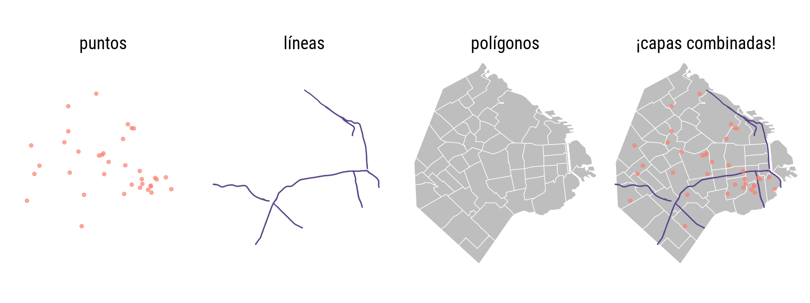
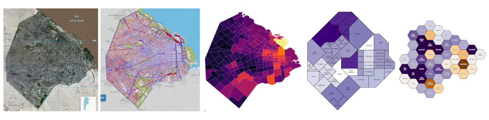
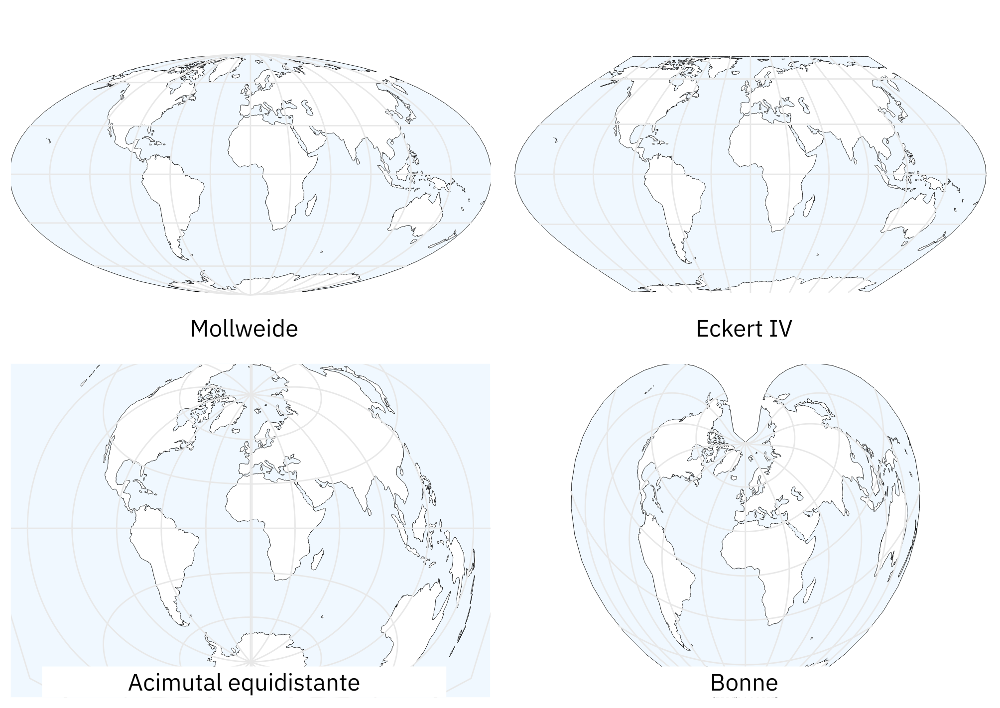
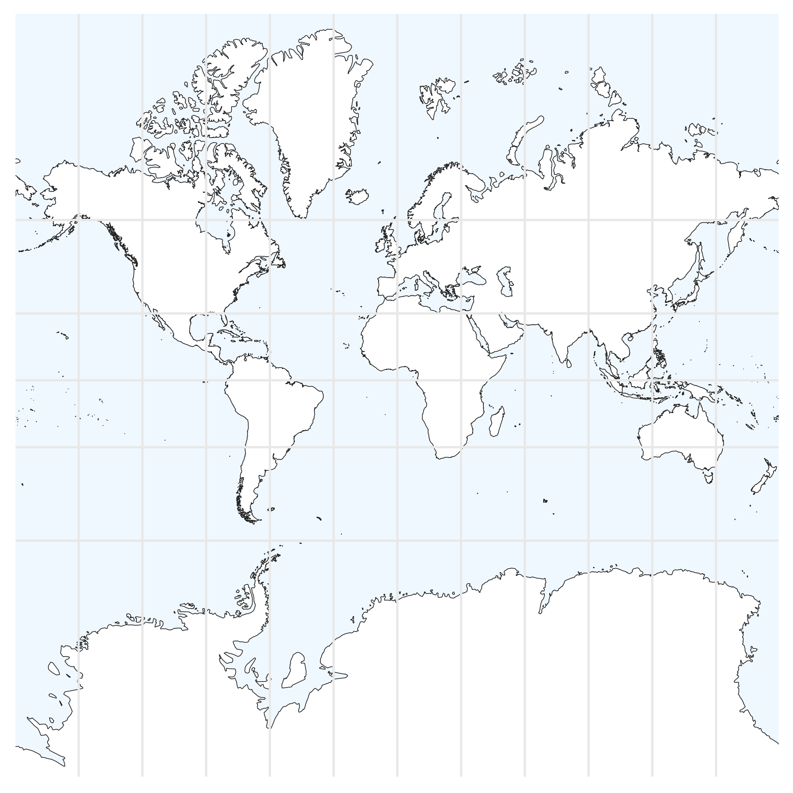
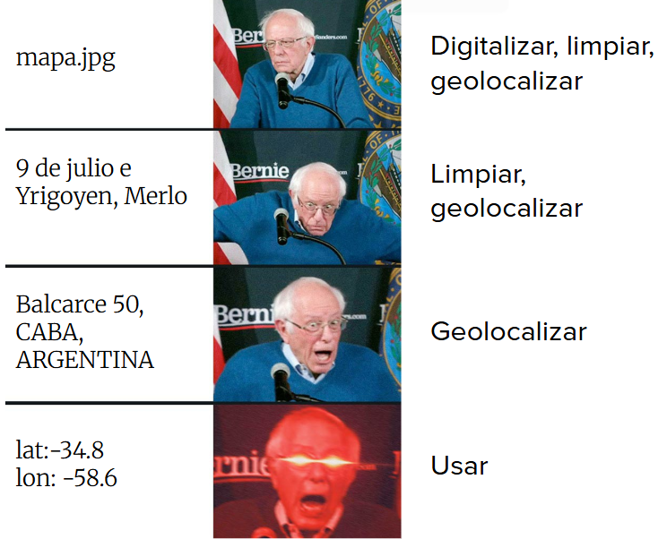
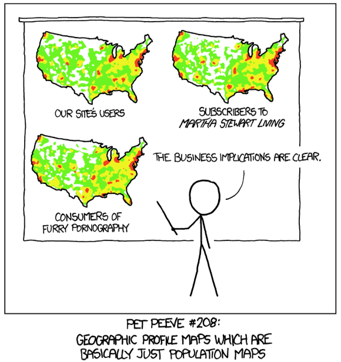
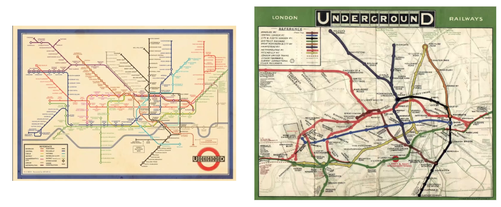
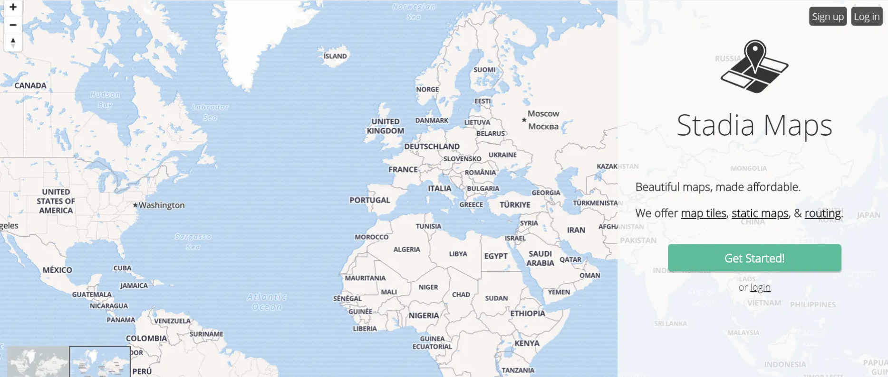

```{r setup, include=FALSE}
library(ggplot2)
library(sf)
library(ggmap)
library(leaflet)


radios <- st_read("https://bitsandbricks.github.io/data/CABA_rc.geojson")

sf::sf_use_s2(FALSE)  # evita problemas con geometrías sobre esferas

subte_lineas <- st_read(
  "https://bitsandbricks.github.io/data/subte_lineas.geojson",
  quiet = TRUE,
  stringsAsFactors = FALSE
)

subte_estaciones <- st_read(
  "https://bitsandbricks.github.io/data/subte_estaciones.geojson",
  quiet = TRUE,
  stringsAsFactors = FALSE
)

color_lineas <- c("A" = "cyan", "B" = "red", "C" = "blue",
                  "D" = "darkgreen", "E" = "purple", "H" = "yellow")


#register_stadiamaps(" ") #Entre las " " deben ingresar su clave API que obtienen al registrarse en Stadia Maps

register_stadiamaps("b2b11068-e1b9-41c5-928e-9fba31429510") 

bbox <- st_bbox(radios)
names(bbox) <- c("left", "bottom", "right", "top")
mapa_CABA <- get_stadiamap(bbox, zoom = 12)
mapa_CABA_toner <- get_stadiamap(bbox, maptype = "stamen_toner_lite", zoom = 12)


```

## Información geográfica y mapas

Durante el siglo pasado, los labores de producción de mapas y análisis espacial estaban reservadas para especialistas, debido a la complejidad de las tareas y al alto costo de producción y adquisición de datos geográficos. Sin embargo, durante las dos últimas décadas la tecnología digital cambió el panorama. 

Una dramática caída en el costo asociado a adquirir y procesar información geográfica (pensemos en satélites y computadoras multiplicándose y bajando de precio) dio paso al mapa digital como herramienta universal. El consumo de sofisticados mapas y otros productos geográficos se volvió masivo y cotidiano, con Google Maps como el exponente más conocido. Apenas había pasado la novedad de disponer de mapas en alta resolución de todo el mundo accesibles al instante desde nuestros escritorios, cuando la llegada de los *smartphones* popularizó el acceso en cualquier momento y lugar.

El mismo proceso que nos convirtió a todos en consumidores constantes de información geográfica también nos da la oportunidad de ser los productores. Sin dudas, hacer mapas se ha vuelto más fácil que en el pasado. Existen cada vez más repositorios con información georreferenciada de acceso publico -datasets que incluyen información precisa sobre su ubicación geográfica. Al mismo tiempo, maduran y se hacen más fáciles de usar las herramientas para análisis y visualización espacial.

En los procesos sociales, el "dónde" suele ser un aspecto clave. Es central para quienes estudiamos -por ejemplo- las ciudades o las dinámicas de la política, siempre tan arraigadas a lo territorial. Esto vuelve al mapa una de las herramientas de visualización más importantes que podemos emplear.

En R contamos con varios paquete de funciones que permiten manipular información espacial con facilidad. A continuación vamos a aprender a combinarlos con las herramientas que ya hemos aprendido para hacer análisis geográfico y crear nuestros propios mapas.

### Geometrías

Los archivos de datos geográficos relacionados con fenómenos sociales (datos de cosas que somos y hacemos los humanos, como composición de población, trazado de rutas o ubicación de hospitales) suelen ser de tipo vectorial. Los datos vectoriales expresan la posición y extensión de cosas mediante geometrías, que pueden ser de puntos, de líneas, o de polígonos. En la jerga de los sistemas de información geográfica se les llama "capas" (*layers*) a los archivos que contienen estas geometrías; en ese sentido, se habla de combinar capas para crear mapas.

{width="93%"}

-   Un archivo geográfico con geometría de **puntos** se utiliza para marcar **posiciones**: por ejemplo, puntos que señalen la ubicación de hospitales.

-   La geometría de **líneas** permite mostrar **recorridos**: la extensión de ríos, de autopistas o de calles, son ejemplos típicos.

-   Los **polígonos** se usan cuando hay que representar **superficies**: el territorio de barrios, provincias o países; el terreno ocupado por parques y plazas, la extensión de parcelas o los límites de áreas especiales.


### ¿Cuánto detalle queremos en un mapa?

Cuando trabajamos con información geográfica, una de las primeras decisiones conceptuales es el nivel detalle. No es lo mismo un mapa como “foto del mundo” (una imagen satelital) que un mapa de calles y avenidas, y tampoco es lo mismo representar una ciudad con sus radios censales que con un esquema abstracto de barrios.

{width="93%"}

### Los datos georreferenciados

El atributo que distingue a los datos georreferenciados, lo que los hace merecer ese nombre, es que representan ubicaciones exactas sobre la superficie de la Tierra. Representar en forma precisa una posición sobre la superficie terrestre es un todo un reto. Para empezar, la Tierra tiene una forma irregular. A pesar de cómo solemos imaginarla y dibujarla, no es una esfera perfecta sino que está "achatada" en los polos, dificultando la matemática necesaria para comparar posiciones y medir distancias. Luego, está el problema de cómo mostrar sobre papel impreso, o en una pantalla digital, -superficies planas- rasgos geográficos que pertenecen a una superficie tridimensional esférica. La solución a estos problemas toma la forma de sistemas de coordenadas de referencia (*CRS* por sus siglas en inglés) y de proyecciones cartográficas.

Los CRS son un sistema de números que definen ubicaciones sobre la superficie de la Tierra; funcionan como direcciones. El tipo de CRS más conocido es el que usa latitud y longitud para definir posiciones en los ejes norte-sur y este-oeste.

Las proyecciones cartográficas son instrucciones para traducir a un plano la disposición de puntos ubicados en la esfera terrestre. Algo así como las instrucciones para dibujar en dos dimensiones las disposición de fronteras, accidentes geográficos, calles o cualquier otro objeto que se extiende sobre la superficie curva del planeta. Como en toda traducción, hay algo que se pierde en el proceso. Todo los mapas "mienten", en el sentido en que presentan una versión distorsionada de la superficie de terrestre. Esto es inevitable; no existe forma de pasar de la esfera al plano sin distorsionar la forma, la superficie, la distancia o la dirección de los rasgo geográficos. Existen muchísimas proyecciones distintas, cada una pensada para minimizar alguno de los tipos de distorsión o para encontrar una solución de compromiso que los balancee.

{width="81%"}

La proyección más famosa es la *Mercator*, en uso desde el siglo XVI cuando fue creada para asistir la navegación marítima. Su fuerte es que no distorsiona las direcciones, por lo que permite fijar un rumbo de navegación consultando el mapa. Su principal problema es que produce una distorsión notable en las áreas cercanas a los polos: Groenlandia aparenta el mismo tamaño que toda África, cuando en realidad tiene sólo un quinceavo de su superficie. Por esa razón, la proyección perdió popularidad en el siglo XX cuando comenzaron a preferirse alternativas que respetan las áreas, como las cuatro mostradas antes. Pero ese no fue el fin: en el siglo XXI la vetusta proyección Mercator recuperó protagonismo. Google la eligió para sus mapas en línea, y por razones de compatibilidad otros proveedores de mapas digitales la adoptaron también. Así, y para entendible irritación de especialistas en geografía, Mercator se convirtió en el estándar de facto para aplicaciones geográficas y mapas en la web.

{width="79%"}

En la práctica, si trabajamos en forma frecuente con archivos georreferenciados vamos a sufrir tarde o temprano de problemas de coordenadas o proyección. El más común de ellos: tener una fuentes de datos geográficos que no podemos comparar con otras, porque desconocemos el sistema de coordenadas que se usó para crearla; es decir, no podemos saber a que posición sobre el planeta corresponde cada observación en los datos.

### Accediendo a datos geográficos

¿Qué datos tenemos? 

{width="50%"}

Otro problema asociado a trabajar con datos geográficos es el de los formatos de archivo.  El formato más común es el denominado "shapefile", inventado por la empresa ESRI (los creadores del software ArcGIS). Es un formato incómodo porque guarda la información en varios archivos distintos, que suelen ser combinados en un archivo .zip para su distribución. 
Un inconveniente aún mayor es que los nombres de las variables en un shapefile deben tener 10 caracteres o menos, lo que facilita el uso de abreviaturas ininteligibles. A pesar de éstos y otros detrimentos, el formato es tan común que se ha vuelto sinónimo de archivo con información geográfica, y resiste a pesar de los esfuerzos por reemplazarlo con alternativas más modernas. Una de ellas es "GeoJSON", un estándar abierto que corrige los dos inconvenientes mencionados antes. Para nuestros ejercicios usaremos datos geográficos en esta último formato.

Vamos a trabajar, como siempre con `ggplot2`. Y ahora también sumamos el paquete [`sf`](https://r-spatial.github.io/sf/), que brinda funciones para trabajar con datos georefrenciados.

```{r echo=TRUE, eval=FALSE}
library(ggplot2)
library(sf)
```

Practicaremos con datos georeferenciados en polígonos: el territorio de la Ciudad de Buenos Aires dividido en radios censales, la unidad geográfica más pequeña para la que se dispone de datos públicos producidos por el censo nacional.

Podemos leemos el archivo con datos geográficos directo desde internet:

```{r eval=FALSE}
radios <- read_sf("https://bitsandbricks.github.io/data/CABA_rc.geojson")
```

Como con cualquier otro dataset, podemos escribir su nombre de variable y ejecutar la línea para ver el contenido:

```{r}
head(radios)
```

-   "RADIO_ID" es el código que identifica cada radio censal.
-   "BARRIO" y "COMUNA" representan barrio y comuna de cada radio (vaya sorpresa!).
-   "POBLACION" indica la cantidad de habitantes del radio, según Censo 2010.
-   "HOGARES_NBI" representa la cantidad de hogares donde se encontró que al menos una de sus necesidades básicas insatisfechas.
-   "AREA_KM2" indica la superficie.
-   y por último queda la columna `geometry`, que contiene una serie de puntos que permiten trazar la silueta de cada radio (sus polígonos). Nosotros no vamos a prestarle atención, pero para R es fundamental, ya que le permite proyectar mapas y hacer cálculos geométricos cuando se lo pidamos.

Ahora, ¿cómo podemos ver el sistema de coordenadas de nuestros datos?

```{r}
st_crs(radios)
```

Está en WGS 84, que son las siglas del sistema de coordenadas World Geodetic System 1984 también conocido como Pseudo-Mercator. Si quisiéramos cambiarlo a otro sistema de coordenadas, podríamos usar la función `st_transform()`. Por ejemplo, para trasladarlo a Mercator:

```{r}
radios_mercator <- st_transform(radios, 3857)
st_crs(radios_mercator)
```

Ahora, a generar mapas.

## Visualizando información geográfica

La visualización de información geográfica por excelencia es el mapa... ¡por supuesto!

`ggplot()` puede graficar datos geográficos empleando la geometría `geom_sf()`. Probemos:

```{r}
ggplot(radios) +
  geom_sf()
```

Ahora usemos el atributo estético "fill" para pintar el interior de cada polígono de acuerdo a la cantidad de gente que vive allí (variable "POBLACION"):

```{r}
ggplot(radios) + 
  geom_sf(aes(fill = POBLACION)) 
```

Continuemos puliendo el gráfico. 
Cuando pintamos polígonos para mostrar datos, el grosor de la línea que traza las fronteras a veces hace difícil determinar el color de relleno. Esto suele pasar cuando se muestra información geográfica intrincada como la de los radios censales. Una solución es definir el color de la línea como `NA`, que para `ggplot` significa "ninguno". Como siempre que queremos modificar un atributo estético en forma arbitraria -un valor fijo, que no dependa de los datos- debemos hacerlo por fuera de `aes()`:

```{r}
ggplot(radios) + 
  geom_sf(aes(fill = POBLACION), color = NA) 
```

Así esta mejor.

Algo importante que no hemos mencionado aún es la importancia de "normalizar" las variables antes de mostrarlas en un mapa. 


{width="30%"}

En general, los lugares más grandes van a contener dentro "más" de cualquier variable que los lugares pequeños (sean personas, comercios o accidentes). Es de esperarse que en el barrio más pequeño de la ciudad vivan menos personas que en el más grande; lo que es útil saber es si los valores son bajo o altos para un área *con esa extensión*. Ejemplos típicos:

-   En lugar de mostrar "número de crímenes por barrio" es más instructivo mostrar el número de crímenes per cápita; de lo contrario es de esperar que los lugares más poblados siempre registren más incidentes, lo cual no agrega demasiada información.
-   En lugar de mostrar "cantidad de habitantes por radio censal", mostramos la densidad de población, es decir la cantidad de habitantes dividida por la extensión del área. Los mapas de densidad muestran mucho mejor la distribución espacial de la población.

Con nuestros datos, podemos visualizar la densidad de la población mostrando la cantidad de habitantes dividida por la superficie del polígono. O sea, POBLACION / AREA_KM2:

```{r}
ggplot(radios) + 
  geom_sf(aes(fill = POBLACION/AREA_KM2), color = NA) 
```

Este último gráfico representa de forma mucho mas precisa la distribución de habitantes en la ciudad, haciendo saltar a la vista los núcleos con mayor densidad de población. Pero tenemos una mejora más por realizar: elegir una escala de color que haga más legible el gráfico, ayudando al ojo a diferenciar las áreas donde la densidad es particularmente alta o baja. Apelamos a ["viridis"](https://cran.r-project.org/web/packages/viridis/vignettes/intro-to-viridis.html), una escala diseñada para ser fácil de interpretar... y lucir bien de paso. Para usar virids, agregamos `scale_fill_viridis_d()` cuando se muestra una variable categórica, y `scale_fill_viridis_c()`cuando se trata de una variable continua, nuestro caso en este momento.

¿Cómo queda con la escala viridis?

```{r}
ggplot() +
  geom_sf(data = radios, aes(fill = POBLACION/AREA_KM2), color = NA) +
  scale_fill_viridis_c() 
```

Si vamos a compartir este gráfico, necesitamos agregar un título descriptivo, definir nombres claros para las leyendas, etc. 
Además, podemos elegir un tema que resulte adecuado para mostrar datos geográficos. Dos opciones disponibles son `theme_minimal()`, que ya hemos probado, y `theme_void()`. Probemos usando uno u otro. ¿Cuál es la diferencia?

```{r}
ggplot() +
  geom_sf(data = radios, aes(fill = POBLACION/AREA_KM2), color = NA) +
  scale_fill_viridis_c() +
  labs(title = "Ciudad Autónoma de Buenos Aires",
       subtitle = "Densidad de población",
       fill = "hab/km2") + 
  theme_minimal()
```
```{r}
ggplot() +
  geom_sf(data = radios, aes(fill = POBLACION/AREA_KM2), color = NA) +
  scale_fill_viridis_c() +
  labs(title = "Ciudad Autónoma de Buenos Aires",
       subtitle = "Densidad de población",
       fill = "hab/km2") + 
    theme_void()
```


## Volcando en el mapa múltiples capas de información

En algunos casos, un archivo con información geográfica contiene todos los datos que necesitamos. Pero lo habitual es que el archivo sólo brinde la ubicación y fronteras de nuestras unidades de análisis, de manera que necesitamos agregarle los datos que hemos obtenido de otras fuentes y queremos proyectar en un mapa.

Comentamos al principio de la clase que los archivos con datos espaciales pueden representar áreas (polígonos), líneas o puntos. Hasta ahora hemos hecho mapas con polígonos, pero según el caso podríamos querer mostrar otros tipos de geometría.

Un ámbito donde es común utilizar toda la variedad de geometrías es el transporte: polígonos para representar distritos, líneas para el recorrido de un sistema de transporte y puntos para la ubicación de las estaciones.

Sumemos a nuestra colección datos espaciales con

-   las líneas de transporte subterráneo (SUBTE) de la ciudad

```{r eval=FALSE}
subte_lineas <- read_sf("http://bitsandbricks.github.io/data/subte_lineas.geojson")
```

```{r echo=FALSE}
subte_lineas
```

-   y los puntos con las ubicaciones de las estaciones de SUBTE

```{r eval=FALSE}
subte_estaciones <- read_sf("http://bitsandbricks.github.io/data/subte_estaciones.geojson")
```

```{r echo=FALSE}
head(subte_estaciones)
```

Combinar capas mostrado distintas geometrías es simple. Sólo es cuestión de sumar capas de `geom_sf()` asignando a cada una un dataframe espacial a mostrar con el parámetro "data"; por ejemplo, `data = radios`. Mostremos los radios censales (`data = radios`) y el trazado de las líneas de transporte (`data = subte_lineas`) en el mismo mapa:

```{r}
ggplot() +
    geom_sf(data = radios) +
    geom_sf(data = subte_lineas) 
```

Y del mismo modo, sumemos una capa más para mostrar la ubicación de las estaciones (`data = subte_estaciones`):

```{r}
ggplot() +
    geom_sf(data = radios) +
    geom_sf(data = subte_lineas) +
    geom_sf(data = subte_estaciones)
```

### Síntesis y costos de la abstracción

Aquí aparece un ejemplo clásico del dilema de capas múltiples. El mapa esquemático del subte no intenta ser topográficamente fiel, sino funcionalmente inteligible. Permite ver en qué momentos las líneas viajan juntas, dónde están los extremos y cómo combinar recorridos. Esa claridad tiene un costo: puede hacernos creer que dos estaciones están próximas cuando en el territorio físico no lo están. 

{width="98%"}


### Incorporando color a nuestros mapas

Mostremos cada línea con un color distinto, en base a la variable "LINEA". 
Y hagamos lo mismo para la capa de estaciones.

```{r}
ggplot() +
    geom_sf(data = radios) +
    geom_sf(data = subte_lineas, aes(color = LINEA)) +
    geom_sf(data = subte_estaciones, aes(color = LINEA))
```

¡Funciona! Eso si, el gráfico queda bastante recargado por la abundancia de líneas. Podemos mostrar sólo la extensión de la ciudad, sin detalle interno, para resaltar las líneas de transporte. 
Como hicmos antes, podemos hacer desaparecer la división entre polígonos usando `color = NA`:

```{r}
ggplot() +
    geom_sf(data = radios, color = NA) +
    geom_sf(data = subte_lineas, aes(color = LINEA)) +
    geom_sf(data = subte_estaciones, aes(color = LINEA))

```

Pensando en compartir el resultado, nos queda usar `theme_void()` para un tema minimalista sin panel de fondo, y agregar título y demás textos vía `labs()`:

```{r}
ggplot() +
  geom_sf(data = radios, color = NA) +
  geom_sf(data = subte_lineas, aes(color = LINEA)) +
  geom_sf(data = subte_estaciones, aes(color = LINEA)) +
  labs(title = "Sistema de transporte subterráneo (SUBTE)",
       subtitle = "Ciudad Autónoma de Buenos Aires") +
  theme_void()
```

Este es un caso que amerita elegir los colores de la paleta de visualización a mano. Esto es porque la identidad de las líneas de SUBTE en Buenos Aires está muy asociada a su color oficial y, por lo tanto, resulta confuso verlas representadas en otra gama.

Recurriendo a `scale_color_manual()` como hicimos en una clase anterior, aquí queda el ejercicio resuelto:

```{r}
color_lineas <- c("A" = "cyan", "B" = "red", "C" = "blue",
                  "D" = "darkgreen", "E" = "purple", "H" = "yellow")

ggplot() +
  geom_sf(data = radios, color = NA) +
  geom_sf(data = subte_lineas, aes(color = LINEA)) +
  geom_sf(data = subte_estaciones, aes(color = LINEA)) +
  labs(title = "Sistema de transporte subterráneo (SUBTE)",
       subtitle = "Ciudad Autónoma de Buenos Aires") +
  theme_minimal() +
  scale_color_manual(values = color_lineas)
```


## Obteniendo cartografía de internet

Hasta ahora hemos trabajado con mapas básicos usando solo geom_sf(), mostrando nuestros datos geográficos “flotando” sobre espacio vacío. Pero para dar contexto que guíe a la audiencia, muchas veces es útil proyectar la información sobre un mapa de fondo que muestre la posición de caminos, nombres de localidades, accidentes geográficos y otros hitos. Estos mapas usados como capa de fondo sobre la cual mostrar datos espaciales son conocidos como "mapas base", o *basemaps*. 

Guardar por nuestra cuenta información cartográfica con alto nivel de detalle de cualquier lugar del mundo es impracticable, pero por suerte existen servicios en internet que lo hacen por nosotros. El desafío es elegir proveedores que ofrezcan buena calidad visual y velocidad de carga. OpenStreetMap, aunque popular y gratuito, suele ser lento para cargar y sus mapas base no siempre tienen la calidad visual que necesitamos para una buena visualización de datos. En esta sección exploraremos alternativas más eficientes y visualmente atractivas, tanto para mapas estáticos como interactivos.

Para mapas estáticos de alta calidad, tenemos varias alternativas que superan considerablemente a OpenStreetMap en velocidad y calidad visual, como [Stadia Maps](https://stadiamaps.com/) y [MapTiles] (https://www.maptiler.com/). Esta última opción es recomendable para quienes prefieren evitar el registro de API keys, maptiles ofrece acceso directo a múltiples proveedores.


### Usando ggmap con Stadia Maps (recomendado)

[Stadia Maps](https://stadiamaps.com/) es el sucesor oficial de Stamen Maps, manteniendo los mismos estilos de alta calidad que hicieron famoso a su predecesor. Aunque requiere registro gratuito para obtener una API key, la calidad del resultado justifica este paso adicional. Los estilos de Stadia son especialmente reconocidos por ser ideales para visualización de datos.

{width="99%"}

Para incluir mapas base en nuestras visualizaciones podemos usar las funciones del paquete [`ggmap`](https://github.com/dkahle/ggmap), que complementa a ggplot agregando funciones que permiten adquirir y visualizar mapas en forma fácil.

Lo activamos:

```{r eval=FALSE}
library(ggmap)
```

Ahora, para obtener un mapa base del área donde se encuentran los datos que queremos mostrar, necesitamos determinar su "bounding box": el rango de latitud y longitud que forma un rectángulo conteniendo todas sus posiciones. En resumidas cuentas, se trata de los valores de 1) latitud máxima y mínima y de 2)longitud máxima y mínima de nuestros datos georreferenciados.

Los proveedores de mapas online suelen solicitar los valores en este orden: izquierda, abajo, derecha, arriba. Es decir, posición mas al oeste, posición mas al sur, posición mas al este, posición mas al norte. Cuando disponemos de un dataframe georreferenciado, obtener la *bounding box* de su contenido es bastante fácil usando `st_bbox`, una función del paquete `sf` que recupera esas cuatro coordenadas clave. Por ejemplo `st_bbox(radios)` obtiene las coordenadas del rectángulo de territorio que abarca los radios censales de Buenos Aires. Luego de guardar las coordenadas en una variable, les ponemos los nombres que permitirán que `ggmap` las identifique:

```{r}
bbox <- st_bbox(radios)

bbox_ggmap <- c(left = as.numeric(bbox[1]), 
                bottom = as.numeric(bbox[2]), 
                right = as.numeric(bbox[3]), 
                top = as.numeric(bbox[4]))
```

Ahora si, vamos por ese mapa base.

Lo descargamos entregando la bounding box del área que nos interesa (que ya hemos guardado en la variable "bbox") y un nivel de zoom. El nivel de zoom -un número de 1 a 20- indica el detalle que tendrá el mapa descargado. Para una ciudad, un zoom de entre 10 y 12 suele alcanzar.

```{r message=FALSE, warning=FALSE}
# Stadia Stamen Toner Lite: estilo minimalista ideal para visualización de datos
mapa_base <- get_stadiamap(bbox_ggmap, 
                          zoom = 12)
```

Para ver el resultado usamos `ggmap()`, pasándole como parámetro el mapa que acabamos de descargar:

```{r}
ggmap(mapa_base)
```

Pueden probar el resultado con niveles de zoom más bajos y más altos, pero cuidado al elegir un zoom elevado para un área grande... pueden tener que esperar un rato largo a que termine la descarga de los datos.

Stadia ofrece varios estilos de mapa base, que pueden revisarse en su [sitio web](https://stadiamaps.com/). Entre ellos:

-   `terrain` (usado por defecto)
-   `toner` (monocromático)
-   `toner_lite` (versión alternativa de toner, de menos contraste visual)
-   `watercolor` (hay que probarlo para apreciarlo, pero digamos que es artístico)

Cuando descargamos un mapa que vamos a usar de base para visualizar datos siempre es una buena idea elegir una opción en escala de grises, sin colores que compitan contra los datos que proyectaremos.

Probamos entonces descargar una monocromática, pasando una vez mas nuestra bbox y agregamdo el parámetro `maptype = "stamen_toner_lite"`:

```{r message=FALSE, warning=FALSE}
mapa_CABA_toner <- get_stadiamap(bbox_ggmap, 
                          maptype = "stamen_toner_lite", 
                          zoom = 12)

ggmap(mapa_CABA_toner)
```

Y por fin, para mostrar nuestros propios datos, como hicimos antes con ggplot... la verdad es que no hay mucho esfuerzo extra! Podemos usar casi el mismo código. Sólo necesitamos recordar dos cosas:

-   en vez de comenzar con `ggplot()`, comenzamos la visualización con `ggmap(mapa_CABA_toner)`
-   donde usamos `geom_sf()`, agregamos el parámetro `inherit.aes = FALSE`.

El segundo punto es necesario por que `ggmap()` usa un sistema particular de coordenadas de referencia, que pueden causar problemas si son distintas a la de los datos geográficos que muestra `geom_sf()`. Al agregar ese parámetro, se le indica a `geom_sf()` que no intente usar ("heredar") las coordenadas de `ggmap()`, y listo.

A intentarlo:

```{r}
ggmap(mapa_CABA_toner) +
  geom_sf(data = subte_lineas, 
          aes(color = LINEA), 
          linewidth = 0.7, 
          inherit.aes = FALSE) +
  geom_sf(data = subte_estaciones, 
          aes(color = LINEA), 
          size = 2, 
          inherit.aes = FALSE) +
  scale_color_manual(values = color_lineas) +
  theme_void() +
  labs(title = "Sistema de transporte subterráneo (SUBTE)",
       subtitle = "Ciudad Autónoma de Buenos Aires")
```

La función `get_stadiamap()` descarga tiles de mapa desde los servidores de Stadia y las combina en una imagen que `ggmap()` usa como fondo. El parámetro `inherit.aes = FALSE` en las capas geom_sf() es crucial: le dice a ggplot que no use las coordenadas del mapa base para estas geometrías, sino sus propias coordenadas espaciales.

En esta ocasión no usamos la capa de radios, como si habíamos visualizado en el ejemplo con `ggplot`. ¿Porqué creen que fue? ¿Cómo mostrarían la capa de radios?

### Explorando otros estilos de Stadia Maps

Stadia ofrece varios estilos heredados de Stamen, cada uno optimizado para diferentes tipos de visualización:

*Stamen Toner*: alto contraste, excelente para datos destacados

```{r}
mapa_toner <- get_stadiamap(bbox_ggmap, 
                           maptype = "stamen_toner", 
                           zoom = 12)
```
```{r}
ggmap(mapa_toner) +
  geom_sf(data = subte_lineas, 
          aes(color = LINEA), 
          linewidth = 0.8, 
          inherit.aes = FALSE) +
  geom_sf(data = subte_estaciones, 
          aes(color = LINEA), 
          size = 2.5, 
          inherit.aes = FALSE) +
  scale_color_manual(values = color_lineas) +
  theme_void()
```

*Stamen Watercolor*: estilo artístico, ideal para presentaciones especiales


```{r}
mapa_watercolor <- get_stadiamap(bbox_ggmap, 
                                maptype = "stamen_watercolor", 
                                zoom = 12)
```

```{r}
ggmap(mapa_watercolor) +
  geom_sf(data = subte_lineas, 
          aes(color = LINEA), 
          linewidth = 1.2, 
          inherit.aes = FALSE) +
  geom_sf(data = subte_estaciones, 
          aes(color = LINEA), 
          size = 3, 
          inherit.aes = FALSE) +
  scale_color_manual(values = color_lineas) +
  theme_void()
```
### ¿Cuándo usar cada estilo de Stadia? 
- _stamen_toner_lite_: fondo súper limpio, perfecto cuando nuestros datos son el protagonista absoluto 

- _stamen_toner_: alto contraste en blanco y negro, excelente para datos que necesitan destacar 

- _stamen_watercolor_: estilo artístico y único, ideal para presentaciones donde queremos “wow factor”


## Mapas interactivos

Los mapas estáticos son ideales para reportes impresos o presentaciones, porque comunican un mensaje “cerrado” y directo. En cambio, cuando compartimos nuestro trabajo en formato digital (HTML, dashboards, sitios web), los mapas interactivos habilitan una experiencia mucho más rica: zoom, panorámica, popups y control de capas.

En `R`, el paquete `leaflet` es el estándar de facto para construir mapas interactivos. Lo interesante es que trabaja por capas, igual que `ggplot2`: primero definimos un lienzo (el mapa) y luego sumamos elementos (líneas, puntos, polígonos) con funciones específicas.

### Mapas interactivos con leaflet

Desde R es fácil proyectar nuestros datos sobre mapas interactivos, usando el paquete `leaflet`.

Lo activamos con:

```{r eval=FALSE}
library(leaflet)
```
`Leaflet` trabaja exclusivamente con el sistema de coordenadas WGS84 (EPSG:4326), el mismo que usan GPS y mapas web. Si nuestros datos están en otro sistema de coordenadas, debemos transformarlos:

```{r}
subte_lineas_wgs84 <- st_transform(subte_lineas, 4326)
subte_estaciones_wgs84 <- st_transform(subte_estaciones, 4326)
radios_wgs84 <- st_transform(radios, 4326)
```
En Buenos Aires, el color “oficial” de cada línea es parte de su identidad visual. Por eso conviene fijar una paleta consistente.
```{r}
# Colores oficiales del subte de Buenos Aires
pal <- colorFactor(palette = c("cyan3", "red", "blue", "green3", "purple", "yellow2"),
                   domain = c("A", "B", "C", "D", "E", "H"))
```

### Nuestro primer mapa interactivo

El uso de leaflet es similar al de ggplot; uno toma un dataframe y lo muestra mediante capas que exponen distintos aspectos de la información. Empezamos con un mapa base (tiles) y sumamos capas: (1) líneas del subte con addPolylines() y (2) estaciones con addCircleMarkers()

```{r}
leaflet() %>%
  addProviderTiles(providers$CartoDB.Positron) %>%
  addPolylines(data = subte_lineas_wgs84, 
               color = ~pal(LINEA), 
               weight = 4,
               opacity = 0.6) %>%
  addCircleMarkers(data = subte_estaciones_wgs84,
                   color = ~pal(LINEA),
                   fillColor = ~pal(LINEA),
                   radius = 6,
                   fillOpacity = 0.6)
```

### Agregando popups

Una de las grandes ventajas de leaflet son los popups que aparecen al hacer clic. Empezemos con algo simple:

```{r}
leaflet() %>%
  addProviderTiles(providers$CartoDB.Positron) %>%
    addPolylines(data = subte_lineas_wgs84, 
               color = ~pal(LINEA), 
               weight = 4,
               opacity = 0.6) %>%
  addCircleMarkers(data = subte_estaciones_wgs84,
                   color = ~pal(LINEA),
                   fillColor = ~pal(LINEA),
                   radius = 6,
                   fillOpacity = 0.6,
                    popup = ~paste("Estación:", ESTACION))
```


Podemos hacer los popups más atractivos con un poco de HTML básico:

```{r}
leaflet() %>%
  addProviderTiles(providers$CartoDB.Positron) %>%
      addPolylines(data = subte_lineas_wgs84, 
               color = ~pal(LINEA), 
               weight = 4,
               opacity = 0.6,
               popup = ~paste("<b>Línea", LINEA, "</b>")) %>%
  addCircleMarkers(data = subte_estaciones_wgs84,
                   color = ~pal(LINEA),
                   fillColor = ~pal(LINEA),
                   radius = 6,
                   fillOpacity = 0.6,
                    popup = ~paste("<b>", ESTACION, "</b><br>",
                                 "Línea:", LINEA))
```

### Control básico de capas

Podemos permitir que los usuarios activen y desactiven diferentes elementos:

```{r}
leaflet() %>%
  addProviderTiles(providers$CartoDB.Positron) %>%
  addPolylines(data = subte_lineas_wgs84, 
               color = ~pal(LINEA), 
               weight = 4,
               opacity = 0.6,
               popup = ~paste("<b>Línea", LINEA, "</b>"),
               group = "Líneas") %>%  # ¡Agregá esto!
  addCircleMarkers(data = subte_estaciones_wgs84,
                   color = ~pal(LINEA),
                   fillColor = ~pal(LINEA),
                   radius = 6,
                   fillOpacity = 0.6,
                   popup = ~paste("<b>", ESTACION, "</b><br>",
                                 "Línea:", LINEA),
                   group = "Estaciones") %>%  # ¡Y esto!
  # Control de capas
  addLayersControl(
    overlayGroups = c("Líneas", "Estaciones"),
    options = layersControlOptions(collapsed = FALSE)
  )
```

También podemos ofrecer diferentes estilos de mapa base:

```{r}
mapa_final <- leaflet() %>%
  # Diferentes opciones de mapa base
  addProviderTiles(providers$CartoDB.Positron, group = "Claro") %>%
  addProviderTiles(providers$CartoDB.DarkMatter, group = "Oscuro") %>%
  addProviderTiles(providers$Esri.WorldStreetMap, group = "Calles") %>%
  # Datos del subte
  addPolylines(data = subte_lineas_wgs84, 
               color = ~pal(LINEA),  # Cambié esto
               weight = 4,
               opacity = 0.8,
               popup = ~paste("<b>Línea", LINEA, "</b>"),
               group = "Subte") %>%
  addCircleMarkers(data = subte_estaciones_wgs84,
                   color = ~pal(LINEA),  # Cambié esto
                   fillColor = ~pal(LINEA),  # Agregué esto
                   radius = 8,
                   fillOpacity = 0.8,
                   popup = ~paste("<b>", ESTACION, "</b><br>Línea:", LINEA),
                   group = "Subte") %>%
  # Control de capas
  addLayersControl(
    baseGroups = c("Claro", "Oscuro", "Calles"),
    overlayGroups = c("Subte"),
    options = layersControlOptions(collapsed = FALSE)
  )

# Mostrar el mapa
mapa_final
```


#### Exportando mapas interactivos a HTML

Una de las grandes ventajas de leaflet es que podemos guardar nuestros mapas como archivos HTML independientes para compartir:

```{r}
library(htmlwidgets)

# Guardar el mapa como archivo HTML
saveWidget(mapa_final, 
          file = "mapa_subte_interactivo.html",
          selfcontained = TRUE)
```

`selfcontained = TRUE` hace que el archivo HTML incluya todas las dependencias necesarias, creando un archivo único que se puede compartir sin problemas. El archivo resultante puede abrirse en cualquier navegador web y mantiene toda la funcionalidad interactiva.


## Resumiendo: ¿cuándo usar cada enfoque?

El ecosistema de mapas en R nos ofrece múltiples caminos, cada uno con sus fortalezas:

_Para mapas estáticos_ 

- ggmap con Stadia Maps: calidad excepcional, estilos únicos diseñados para visualización de datos, requiere API key gratuita 

- maptiles: sin registros, múltiples proveedores, ideal para casos rápidos

_Para mapas interactivos_

- leaflet: el estándar de facto, interactividad completa, popups, control de capas, y fácil exportación a HTML

*¿Por qué evitar OpenStreetMap como proveedor principal?*

1. Velocidad: Los servidores de OSM son más lentos que CartoDB o Esri 

2. Calidad visual: Los tiles de OSM no están optimizados para visualización de datos 

3. Carga en servidores: OSM es un proyecto colaborativo sin fines de lucro; usar alternativas comerciales reduce la carga

*¿Cuándo usar mapas estáticos vs interactivos?* 

- Estáticos: reportes PDF, presentaciones impresas, cuando el mensaje debe ser directo y sin distracciones 

- Interactivos: reportes HTML, dashboards, sitios web, cuando queremos que el usuario explore los datos


_Consejos para leaflet_ 

- Empezar simple: primero el mapa básico, después agregar popups y controles 

- Los grupos permiten que el usuario controle qué ver 

- Exportar a HTML permite compartir mapas sin necesidad de R


_Sugerencia para mostrar los radios censales_

En esta ocasión no usamos la capa de radios en los primeros ejemplos, como sí habíamos visualizado en los ejemplos anteriores con ggplot básico. ¿Por qué creen que fue? La respuesta está en la *legibilidad*: cuando agregamos un mapa base detallado, mostrar también los límites de todos los radios censales puede crear sobrecarga visual que dificulta ver nuestros datos principales (las líneas y estaciones del subte).

Si queremos incluir esta capa, podemos agregarla con transparencia alta en mapas estáticos (geom_sf(data = radios, fill = "transparent", color = "gray80", linewidth = 0.2)) o como capa opcional controlable por el usuario en mapas interactivos (como mostramos en los ejemplos avanzados de leaflet).


Para profundizar en estas técnicas, recomendamos revisar el capítulo ["Draw maps"](https://socviz.co/maps.html) en *Data Visualization - A practical introduction*, y explorar ["la galería de ejemplos de leaflet"](https://rstudio.github.io/leaflet/) para descubrir funcionalidades más avanzadas como clustering de puntos, mapas de calor, y animaciones temporales.
